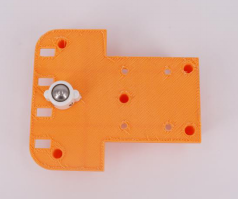
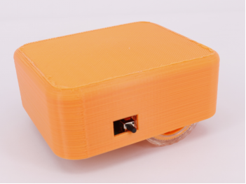

# 机器人主板

## 概述

3D打印机器人主板集合了5个扩展口、电机驱动、蜂鸣器、巡线、红外接收、锂电池充放电、物联网通讯等功能，可通过3D打印外壳配合在线编程完成各种有趣的设计，使用户在学习编程的同时开阔思维，实现创意，方便快速的造物。

## 参数

* 控制芯片：32位好搭定制ARM芯片 
* 尺寸：87x87（mm）

## 功能说明

1.排针5排—P23-P27; 2.灰度传感器—P10-P13; 3.电机MA速度控制—P21; 4.电机MA方向控制—P36; 5.电机MB速度控制—P22; 6.电机MB方向控制—P37; 7.蜂鸣器—P20; 8.红外接收—P06;

## 使用方式

连接USB可直接进行USB下载，电源指示灯在充电状态时闪烁，电池充满状态时常亮。 连接WIFI下载板，按下电源键开关机，关机状态按下WIFI配置键,蜂鸣器响一声，在好好搭搭公众号的好搭物联网小程序进行WIFI配置，配置成功后即可无线连接并下载。

## 扩展玩法

小车案例： Step 1:将牛眼轮与外壳连接。

Step 2:将WIFI模块与主板相连。

Step 3：将电池与主板通过锂电池接口连接。

Step 4：将电机与主板通过接口连接，并且固定在外壳

Step 5：盖上外壳，机器人即组装完毕。按下电源键，电源指示灯亮，通过无线编程即可使机器人做出相应的动作。

## 示例代码

此处制作一个巡线小车。

[小车案例示例代码](http://www.haohaodada.com/wulink-nano/index.php?id=5701)

## 原理图

[机器人主板原理图](https://github.com/Haohaodada-official/docs/blob/master/3d-da-yin-tao-jian/pdf/机器人主板.pdf)

## 常见问题

1.微信配置不上网络

请尝试用WEB方式配置。

2.配置网络的原理是什么

通过手机把我们的路由器的网络账号告诉WU-Link，让她能顺利的连上网络

3.一个路由器最多能带几台设备

一般路由建议不要超过10台设备。

4.怎么解绑MAC地址 在原来绑定的账号里删除即可，如果忘记原来帐号，请联系技术支持。

