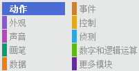
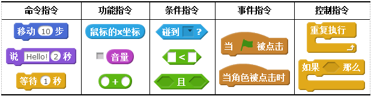

# 指令

Scratch中的指令按不同功能及特性进行了分类，并且使用不同的颜色和外形来加以区别。只要掌握Scratch指令在外观上的这些规律，就能极大地方便编写程序脚本。

## 一、指令的所属类别

在Scratch中，根据功能分为动作、外观、声音等十个类别的指令，每个类别的颜色不同，可以根据颜色找到所需指令的类别。其中，“更多模块”类别用于创建新功能模块和添加外接硬件指令。

[单击此处](http://haohaodada.com/video/a21401.php)或者扫描下方二维码可以观看以上内容相关的视频。

## 二、指令的五种类型

Scratch中的指令共有五种形状，代表着不同类型的指令。

**命令指令：**

Scratch中最常见的指令类型。指令上方有缺口，下方有凸起，用于拼接指令，使得脚本中的指令能够从上至下逐条执行。

**功能指令：**

指令形状为圆角矩形，没有缺口和凸起，因此不能单独使用。这类指令通常用来存储变量的值，可以作为其他指令的参数，也可以通过勾选指令前的复选框，在舞台上直接查看具体的数值。

**条件指令：**

指令形状为六边形，与功能指令一样不能单独使用，通常是作为判断指令的条件参数。“条件指令”只能够得到两种数值：真或假，用“true”或者“false”表示。单击相关指令，能够看到该指令目前的数值。

**事件指令：**

指令形状上方为椭圆形，下方有缺口可以向下拼接指令，因此这类指令总是处于一段程序脚本的起始位置。Scratch是基于“事件驱动”设计程序的，一个角色的程序脚本可以由多个事件组成，用户触发了事件以后，就会执行相应的事件指令。

**控制指令：**

​ 指令上方有缺口，下方凸起，中间开口可以容纳其他指令在它的内部拼接。通常用于判断结构和循环结构，根据具体需求来编写并执行控制指令中间的脚本块。

[单击此处](http://haohaodada.com/video/a21402.php)或者扫描下方二维码观看以上内容相关的视频。

