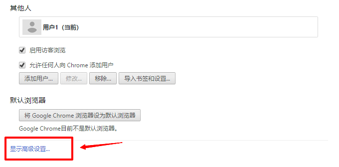

# 浏览器

IE浏览器不支持，支持的浏览器有Chrom、360浏览器、Firefox，我们提供了[绿色版免安装浏览器Chrom](http://www.haohaodada.com/Chrom.rar) 。

## Flash设置

好好搭搭在线Scratch编程是基于MIT Scratch2.0，需要Flash支持，如果编程模板没有跳出Flash动画，请在浏览器里设置允许Flash。

## 下载路径设置

好好搭搭部分产品使用U盘下载模式下载程序，对此类产品下载程序需对修改浏览器设置，在每次下载程序前询问下载位置，操作步骤如下（此处以Chrom浏览器为例）：

1.打开Chrom浏览器，点击右上角自定义键（如下图）。

2.选择设置栏，点击进入设置界面。

3.下拉点击：显示高级设置。

4.在下载内容栏，勾选-下载前询问每个文件的保存位置。

