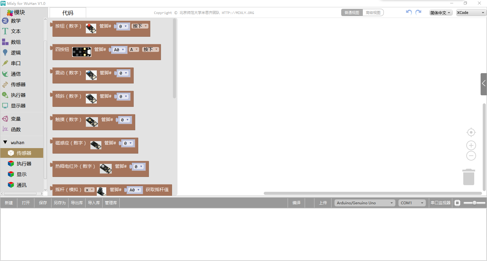

# 好好搭搭Scratch Arduino 2.0

## 概述

支持Arduino、Nova、好搭Box、传感器板的离线编程。

## 下载

百度网盘：

链接：[https://pan.baidu.com/s/1nzX\_n8MsWpbe-lxZzoxIjQ](https://pan.baidu.com/s/1nzX_n8MsWpbe-lxZzoxIjQ)

提取码：te8x

## 常见问题

### 图形块不显示

点击菜单栏/设置/恢复模块文件

