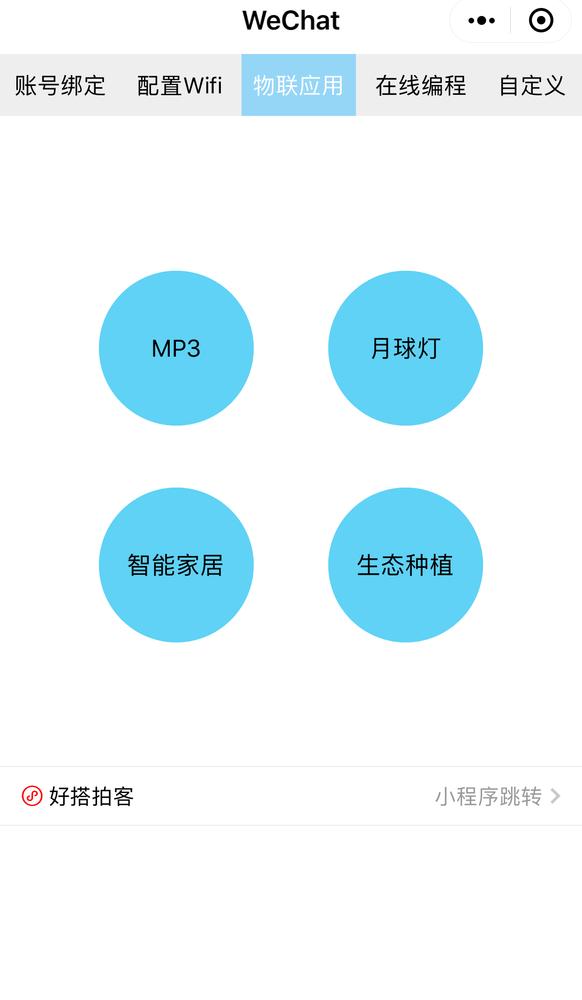
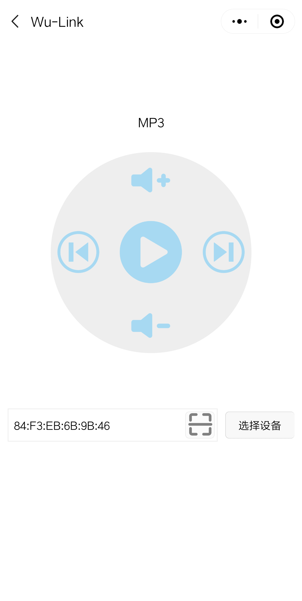
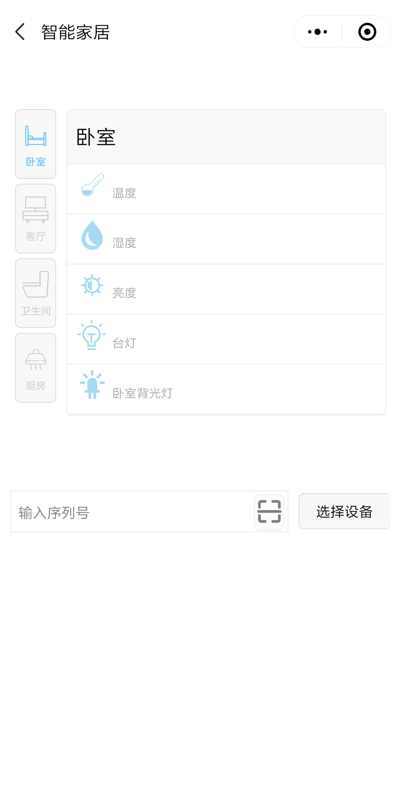
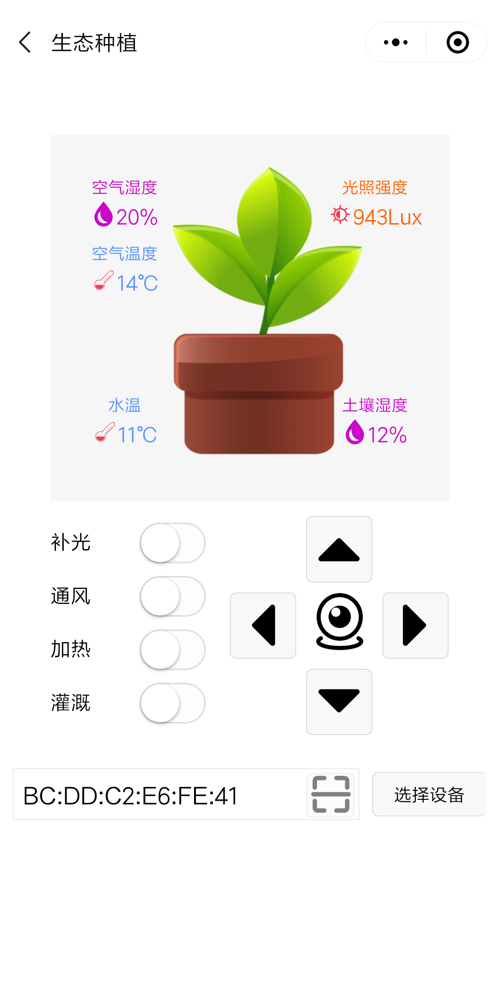

# 物联应用

### 点击物联应用，选择相应的应用进入控制面板

### MP3控制面板

#### 控件对应的物联网消息值

| 控件 | 消息 |
| :--- | :--- |
| 暂停 | stop |
| 播放 | play |
| 上一首 | rev |
| 下一首 | next |
| 音量加 | volu |
| 音量减 | vold |

案例：[mp3案例](http://haohaodada.com/wulink/index.php?id=4567)

### 月球灯控制面板

#### 控件对应的物联网消息值

| 控件 | 消息 |
| :--- | :--- |
| 电源键-开 | Open=1 |
| 电源键-关 | Open=-1 |
| 呼吸灯 | Breathing\_Light=1 |
| 调色面板 | R=255&G=255&B=255   \(颜色值范围：0-255\) |
| 定时 | StartTime=20&StopTime=181\(时间值为分钟\) |

案例：[月球灯案例](http://www.haohaodada.com/3dmoon/index.php?id=3131)

### 智能家居控制面板

#### 控件对应的物联网消息值

| 控件 | 消息 |
| :--- | :--- |
| 加湿器 | Humidifier=1/-1 |
| 温湿度传感器 | Air\_Temperature=0~55℃、Air\_Humidity=0~100% |
| 亮度传感器 | Light=0~1000Lux |
| 背光灯 | Background \_Light\_1=1/-1 |
| 台灯 | Reading\_Lamp=1/-1 |
| 空调 | Air\_Conditioner=1/-1 |
| 电视机 | Television=1/-1 |
| 窗帘 | Curtain=1/-1 |
| 背光灯 | Background \_Light\_2=1/-1 |
| 人体感应 | PIR=1/-1 |
| 背光灯 | Background \_Light\_3=1/-1 |
| 烟雾传感器 | Smog=0~1000 |
| 一氧化碳传感器 | CO=0~1000 |
| 门磁感应 | Door=1/-1 |
| 背光灯 | Background \_Light\_4=1/-1 |

案例：[智能家居](http://www.haohaodada.com/wulink-nano/index.php?id=2086)

### 生态种植面板

#### 控件对应的物联网消息值

| 控件 | 消息 |
| :--- | :--- |
| 光照强度 | Light |
| 空气湿度 | Air\_Humidity |
| 空气温度 | Air\_Temperature |
| 土壤湿度 | Soil\_Moisture |
| 水温 | Water\_Temperature |
| 云台抬头转动 | Up=1 |
| 云台抬头停止 | Up=-1 |
| 云台低头转动 | Down=1 |
| 云台低头停止 | Down=-1 |
| 云台左转转动 | Left=1 |
| 云台左转停止 | Left=-1 |
| 云台右转转动 | Right=1 |
| 云台右转停止 | Right=-1 |
| 补光开 | LED=1 |
| 补光关 | LED=-1 |
| 通风开 | Fan=1 |
| 通风关 | Fan=-1 |
| 加热开 | Heat=1 |
| 加热关 | Heat=-1 |
| 水泵开 | Pump=1 |
| 水泵关 | Pump=-1 |

案例：[生态种植](http://www.haohaodada.com/wulink-nano/index.php?id=5716)

