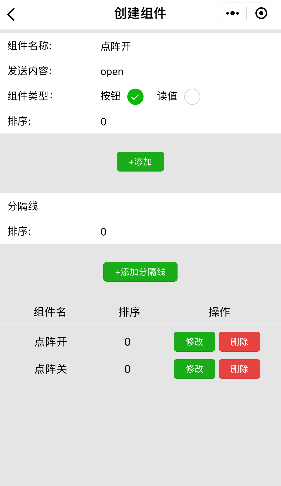

# 自定义组件使用

#### 点击自定义，进入如下界面，点击选择设备选择欲控制的设备。

#### 添加设备后，点击红色的加号添加组件，此处添加了一个点阵开按钮\(指令为open\)及一个点阵关按钮（指令为close）。

#### 添加一个传感器数据读取组件

#### 通过wulink编程界面给设备下载程序，程序主要为当wulink收到open指令，点阵屏全亮；当wulink收到close指令，点阵屏全灭。点击温度栏的更新，获取实时温度。

