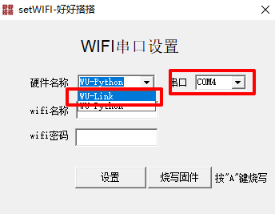

# PC端配网工具

## WULink配网

1.按住B键同时开机，蜂鸣器响一声，状态指示灯红色常亮，WULink进入PC端配网模式，用USB线连接WULink到电脑。

2.[点击此处](http://www.haohaodada.com/zhangkongV06.rar) 下载PC端配网工具，解压文件（注意不要解压到C盘）。

3.打开文件夹，进入setwifi程序。

进入setwifi程序后，下拉硬件名称选择设备，和连接设备的端口。

输入可用wifi名称密码，并点击设置。

4.设置后，WULink蜂鸣器响起，状态指示灯红色闪烁后变为蓝色，则说明配网成功。

