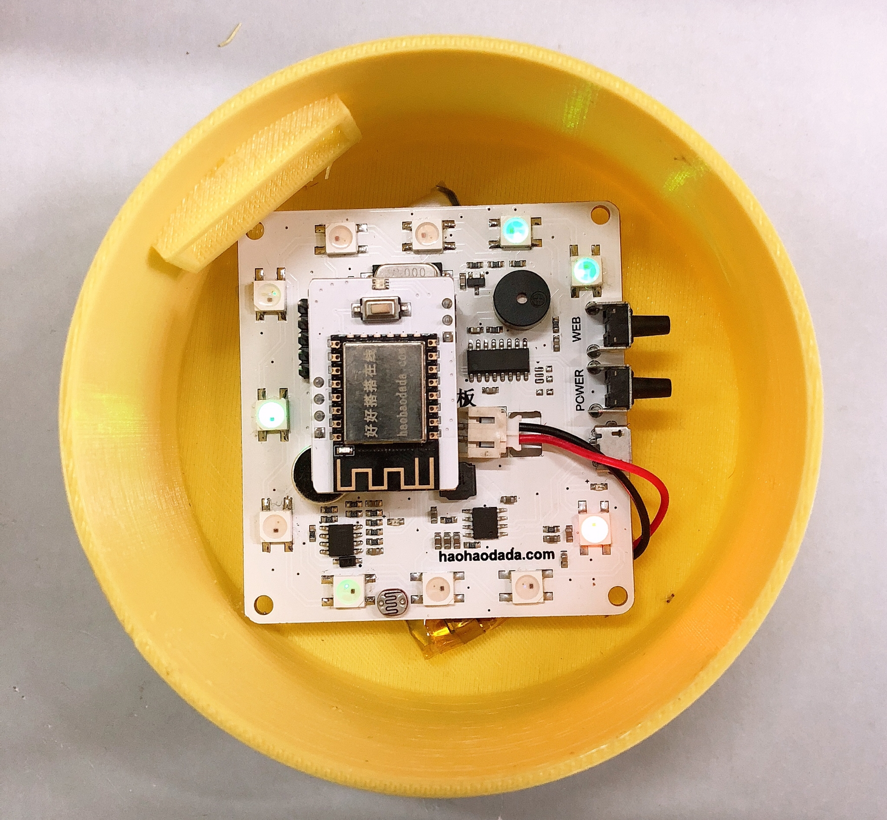

# 灯光主板

## 概述

3D打印灯光主板集合了声音传感器、蜂鸣器、光敏电阻、锂电池充放电、物联网通讯等功能，可通过3D打印外壳配合在线编程完成各种有趣的设计，使用户在学习编程的同时开阔思维，实现创意，方便快速的造物。

## 参数

* 控制芯片：32位好搭定制ARM芯片 
* 尺        寸：67x63（mm）

## 功能说明

1.声音传感器—P11;

2.光敏电阻—P10;

3.蜂鸣器—配网响应;

## 使用方式

连接USB可直接进行USB下载，电源指示灯在充电状态时闪烁，电池充满状态时常亮。 连接WIFI下载板，按下电源键开关机，关机状态按下WIFI配置键,蜂鸣器响一声，在好好搭搭公众号的好搭物联网小程序进行WIFI配置，配置成功后即可无线连接并下载。

## 扩展玩法

灯光案例：

Step 1：将电池与主板通过锂电池接口连接。

Step 2：主板与电池一起放在外壳的相应位置，按下电源键。

Step 3：盖上顶盖，即组装完毕。

Step 4：通过无线下载程序，RGB彩灯即能根据设置好的程序亮起。

## 示例代码

[灯光案例示例代码](http://www.haohaodada.com/wulink-nano/index.php?id=5700)

## 原理图



## 常见问题

1.微信配置不上网络

请尝试用WEB方式配置。

2.配置网络的原理是什么

通过手机把我们的路由器的网络账号告诉WU-Link，让她能顺利的连上网络

3.一个路由器最多能带几台设备

一般路由建议不要超过10台设备。

4.怎么解绑MAC地址 在原来绑定的账号里删除即可，如果忘记原来帐号，请联系技术支持。

