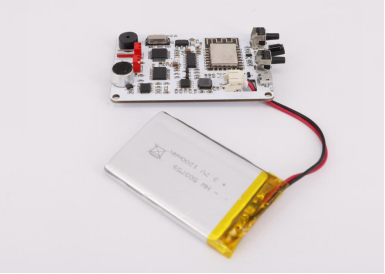
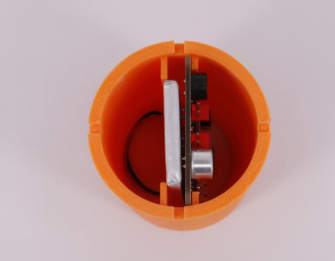
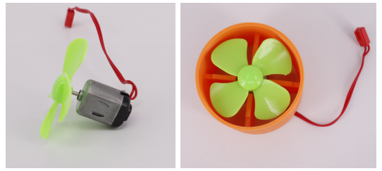
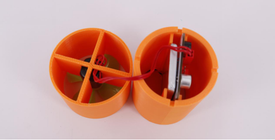
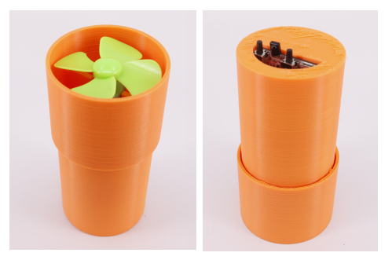
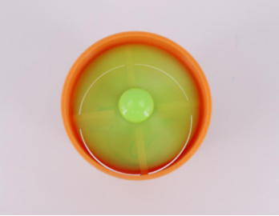
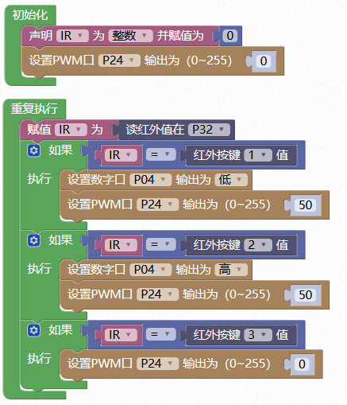

# 电机主板

## 概述

3D打印电机主板集合电机驱动、声音传感器、蜂鸣器、锂电池充放电、物联网通讯等功能，可通过3D打印外壳配合在线编程完成各种有趣的设计，使用户在学习编程的同时开阔思维，实现创意，方便快速的造物。

## 参数

* 控制芯片：32位好搭定制ARM芯片 
* 尺        寸：70x48（mm）

## 功能说明

1.红外接收—P32;

2.电机MA速度控制—P24;

3.电机MA方向控制—P04;

4.电机MB速度控制—P25；

5.电机MB方向控制—P06；

6.蜂鸣器—配网响应；

7.声音传感器—P11；

## 使用方式

连接USB可直接进行USB下载，电源指示灯在充电状态时闪烁，电池充满状态时常亮。 按下电源键开关机，关机状态按下WIFI配置键,蜂鸣器响一声，在好好搭搭公众号的好搭物联网小程序进行WIFI配置，配置成功后即可无线连接并下载。

## 扩展玩法

风扇案例：

Step 1：将电池与主板通过锂电池接口连接。

Step 2：主板与电池一起圆筒形外盒的相应位置。

Step 3：将电机风扇叶与相应部件相连。

Step 4：将电机与主板的电机防反插接口MA/MB连接。

Step 5：将两个部件连接，风扇即组装完毕。

Step 6：按下电源键，电源指示灯亮，无线下载程序，风扇即可转动。 

## 示例代码

此案例使用MA接口。 使用红外遥控器，按下1键，正转；按下2键，反转；按下3键；停止。

[风扇案例示例代码](http://www.haohaodada.com/wulink-nano/index.php?id=5695)

## 原理图

[电机主板原理图](https://github.com/Haohaodada-official/docs/blob/master/3d-da-yin-tao-jian/pdf/电机主板.pdf)

## 常见问题

1.微信配置不上网络

请尝试用WEB方式配置。

2.配置网络的原理是什么

通过手机把我们的路由器的网络账号告诉WU-Link，让她能顺利的连上网络

3.一个路由器最多能带几台设备

一般路由建议不要超过10台设备。

4.怎么解绑MAC地址 在原来绑定的账号里删除即可，如果忘记原来帐号，请联系技术支持。

