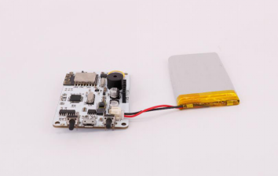
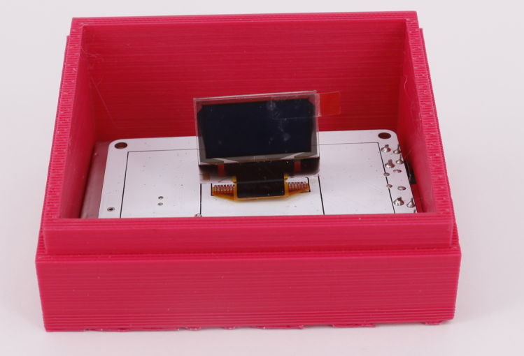
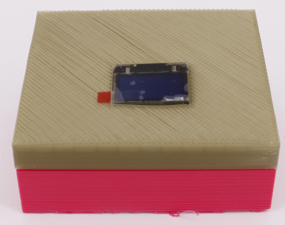
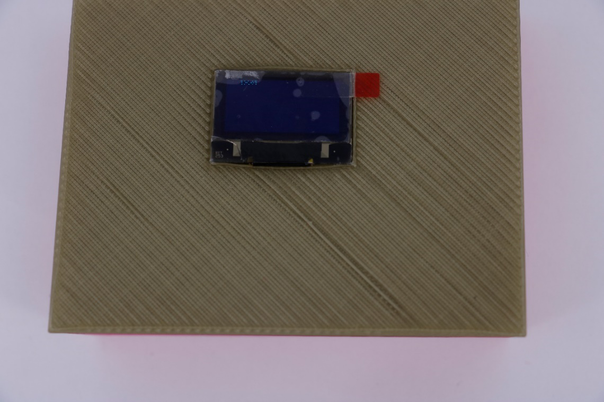
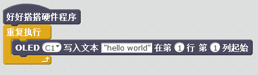

# 互联网主板

## 概述

3D打印互联网主板集合了两个外接扩展口、蜂鸣器、锂电池充放电、温湿度传感器、物联网通讯等功能，可通过3D打印外壳配合在线编程完成各种有趣的设计，使用户在学习编程的同时开阔思维，实现创意，方便快速的造物。

## 参数

* 控制芯片：32位好搭定制ARM芯片 
* 尺寸：70x47（mm）

## 功能说明

1.排母P27—P27;

2.排母P13—P13;

3.蜂鸣器—P20/配网响应;

## 使用方式

连接USB可直接进行USB下载，电源指示灯在充电状态时闪烁，电池充满状态时常亮。 按下电源键开关机，关机状态按下WIFI配置键,蜂鸣器响一声，联网指示灯亮红色，在好好搭搭公众号的好搭物联网小程序进行WIFI配置，配置成功后指示灯变蓝即可无线连接并下载。

## 扩展玩法

互联网案例：

Step 1：将电池与主板通过锂电池接口连接。

Step 2：主板与电池一起放入外壳的相应位置。

Step 3：盖上顶盖，互联网套件即组装完毕。

Step 4：按下电源键，电源指示灯亮，通过无线下载程序后，OLED屏即可显示。

## 示例代码

[互联网案例示例代码](http://www.haohaodada.com/show.php?id=1066004)

## 原理图

[互联网主板原理图](https://github.com/Haohaodada-official/docs/blob/master/3d-da-yin-tao-jian/pdf/互联网主板.pdf)

## 常见问题

1.微信配置不上网络

请尝试用WEB方式配置。

2.配置网络的原理是什么

通过手机把我们的路由器的网络账号告诉WU-Link，让她能顺利的连上网络

3.一个路由器最多能带几台设备

一般路由建议不要超过10台设备。

4.怎么解绑MAC地址 在原来绑定的账号里删除即可，如果忘记原来帐号，请联系技术支持。

