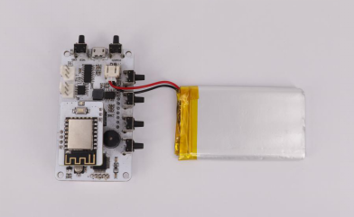
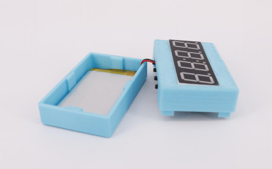
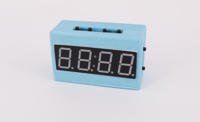
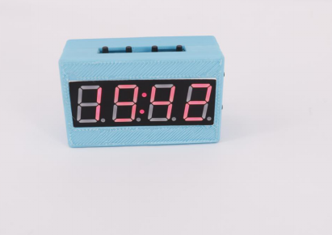
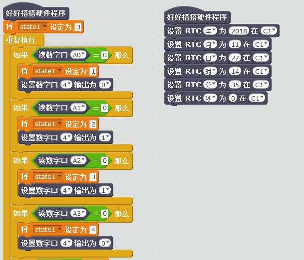
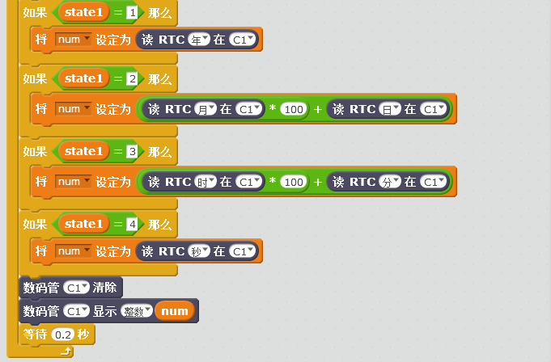

# 时钟主板

## 概述

3D打印时钟主板集合了两个数字外接扩展口、蜂鸣器、锂电池充放电、物联网通讯等功能，可通过3D打印外壳配合在线编程完成各种有趣的设计，使用户在学习编程的同时开阔思维，实现创意，方便快速的造物。

## 参数

* 控制芯片：32位好搭定制ARM芯片 
* 尺寸：72x40（mm）

## 功能说明

1.2510插座P16—P16； 2.2510插座P17—P17； 3.蜂鸣器—P24/配网响应；

## 使用方式

连接USB可直接进行USB下载，电源指示灯在充电状态时闪烁，电池充满状态时常亮。 连接WIFI下载板，按下电源键开关机，关机状态按下WIFI配置键,蜂鸣器响一声，在好好搭搭公众号的好搭物联网小程序进行WIFI配置，配置成功后即可无线连接并下载。

## 扩展玩法

时钟案例： Step 1： 将电池和WIFI模块与主板连接。

Step 2：将主板电池放入外壳中。

Step 3：盖上盖子完成时钟。

Step 4：下载程序。

## 示例代码

[时钟案例示例代码](http://www.haohaodada.com/show.php?id=1065991)

## 原理图

[时钟主板原理图](https://github.com/Haohaodada-official/docs/blob/master/3d-da-yin-tao-jian/pdf/时钟主板.pdf)

## 常见问题

1.微信配置不上网络

请尝试用WEB方式配置。

2.配置网络的原理是什么

通过手机把我们的路由器的网络账号告诉WU-Link，让她能顺利的连上网络

3.一个路由器最多能带几台设备

一般路由建议不要超过10台设备。

4.怎么解绑MAC地址 在原来绑定的账号里删除即可，如果忘记原来帐号，请联系技术支持。

