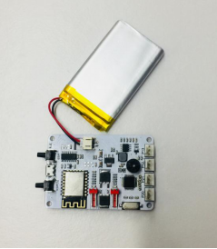
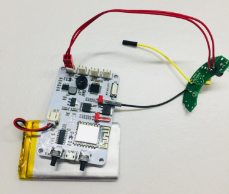
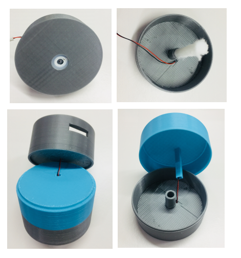
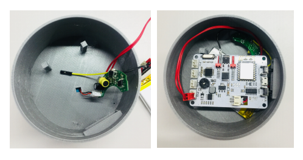
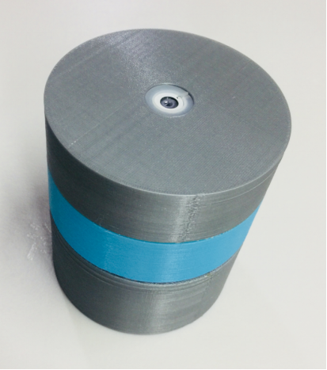
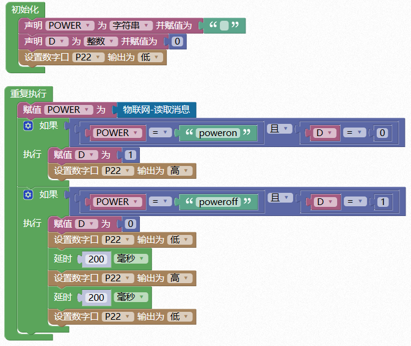

# 通用主板

## 概述

3D打印通用主板集合了两个数字扩展口、两个模拟扩展口、蜂鸣器、锂电池充放电、物联网通讯等功能，可通过3D打印外壳配合在线编程完成各种有趣的设计，使用户在学习编程的同时开阔思维，实现创意，方便快速的造物。

## 参数

* 控制芯片：32位好搭定制ARM芯片 
* 尺寸：70x48（mm）

## 功能说明

1.直插插座P20—P20;

2.直插插座P21—P21;

3.直插插座P12—P12;

4.直插插座P13—P13;

5.外接红色2P口P22—P22;

6.外接红色2P口P23—P23;

7.蜂鸣器—配网响应；

## 使用方式

连接USB可直接进行USB下载，电源指示灯在充电状态时闪烁，电池充满状态时常亮。 按下电源键开关机，关机状态按下WIFI配置键,蜂鸣器响一声，在好好搭搭公众号的好搭物联网小程序进行WIFI配置，配置成功后即可无线连接并下载。

## 扩展玩法

加湿器案例：

Step 1：将电池与主板通过锂电池接口连接。

Step 2：将加湿器模块主板与通用主板P22/P23相连。

Step 3：将加湿器模块与外壳连接。

Step 4：将加湿器模块连接并将主板放到合适位置。

Step 5：整体拼装并在蓝色区加水，下载程序即可加湿。

## 示例代码

此案例使用P22外接口。 使用scratch编程界面给物联网发送指令，poweron:加湿器开；poweroff:加湿器关。

[加湿器案例示例代码](http://www.haohaodada.com/wulink-nano/index.php?id=5697)

## 原理图

[通用主板原理图](https://github.com/Haohaodada-official/docs/blob/master/3d-da-yin-tao-jian/pdf/通用主板.pdf)

## 常见问题

1.微信配置不上网络

请尝试用WEB方式配置。

2.配置网络的原理是什么

通过手机把我们的路由器的网络账号告诉WU-Link，让她能顺利的连上网络

3.一个路由器最多能带几台设备

一般路由建议不要超过10台设备。

4.怎么解绑MAC地址 在原来绑定的账号里删除即可，如果忘记原来帐号，请联系技术支持。

