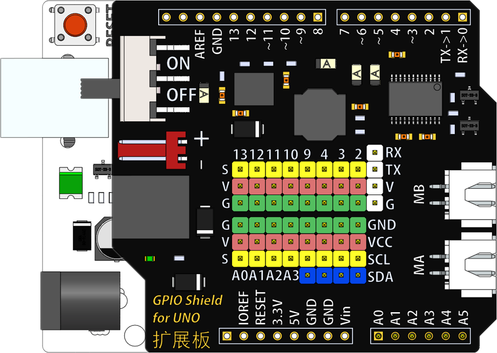

# Arduino IO扩展板

## 概述

IO扩展板是一块与Arduino UNO兼容的扩展板。除了引出Arduino的通用引脚外，扩展板还为每一个管脚单独配备了VCC和GND端口，方便了传感器的接插。此外扩展板还预留了IIC接口、串口，可以更加方便地外接设备。 IO扩展板上板载了一个TB6612FNG双路电机驱动芯片，可同时驱动两路电机，支持PWM控制方式，单通道连续驱动电流1.2A，峰值可达3.2A，可兼容市面上的绝大部分各种微型直流电机。扩展板采用了高性能的电源芯片，弥补了UNO电源输出能力的不足。

## 参数

* 14个数字口
  * 6个模拟口
  * 三色GVS接口
  * 4路I2C接口
  * 1个串口
  * 电池接口输入电压：6—12V
  * Vin接口输入电压：6—12V
  * 电机驱动功能
  * 输出电流：1.2A单通道连续驱动电流。
  * 启动/峰值电流：2A\(连续脉冲\)/3.2A\(单脉冲\)
  * MA电机速度控制口:D5
  * MA电机方向控制口:D7
  * MB电机速度控制口:D6
  * MB电机方向控制口:D8
  * 模块尺寸：58.0 × 53.3\(mm\)

## 接口说明

黄色端子为信号线 红色端子为电源线 绿色端子为地线

白色端子为串口

## 使用方式

## 原理图

[UNO R3原版原理图](https://www.arduino.cc/en/uploads/Main/Arduino_Uno_Rev3-schematic.pdf)

## 常见问题

