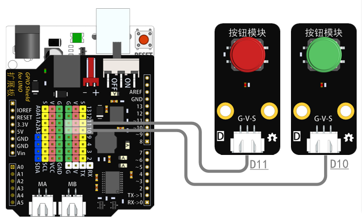
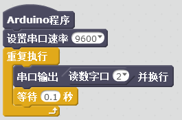

# 单按键模块说明   

## 概述
单按键模块，可输出一个高低电平，按键没有按下时是输出高电平，按下时为输出低电平，从而控制其他的外设等。

## 参数 
- 尺寸：48x24mm
- 工作电压：+3.3-5V
- 接口类型：XH2.54mm-3P
- 引脚定义：1-地 2-电源 3-信号

## 接口说明
- 可用端口：2、3、4、9、10、11、12、13、A0、A1、A2、A3

## 使用方式

## 示例代码

	
[单按键模块示例代码](http://www.haohaodada.com/show.php?id=955486)

## 原理图
[单按键模块原理图](https://github.com/Haohaodada-official/haohaodada-docs/blob/master/%E5%8E%9F%E7%90%86%E5%9B%BE/%E5%8D%95%E6%8C%89%E9%94%AE.pdf)

## 尺寸说明

## 常见问题