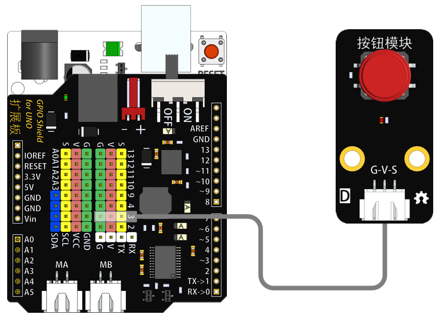
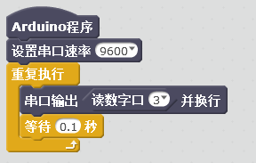

# 单按键模块

## 概述

单按键模块，可输出一个高低电平，按键没有按下时是输出高电平，按下时为输出低电平，从而控制其他的外设等。

## 参数

* 尺寸：48x24mm
* 工作电压：+3.3-5V
* 接口类型：XH2.54mm-3P
* 引脚定义：1-地 2-电源 3-信号

## 接口说明

* 可用端口：2、3、4、9、10、11、12、13、A0、A1、A2、A3

## 使用方式

## 示例代码

[单按键模块示例代码](http://www.haohaodada.com/show.php?id=955486)

## 原理图



## 尺寸说明

## 常见问题

