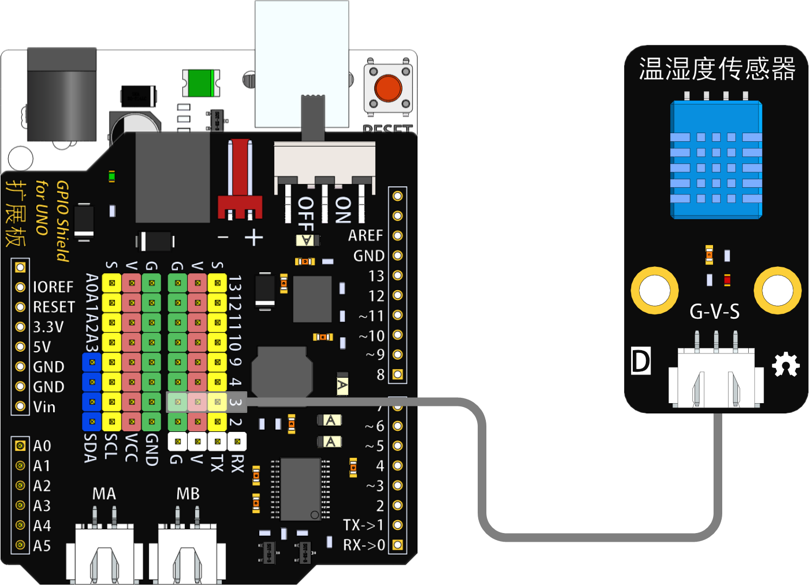
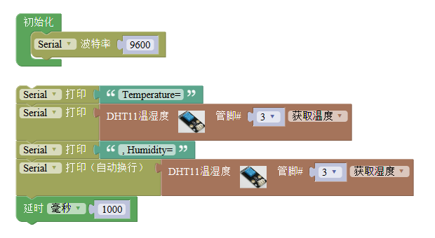
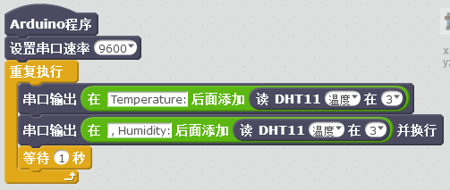

# 温湿度传感器模块

## 概述

DHT11温湿度传感器可同时测量温度和湿度，它应用专用的数字模块采集技术和温湿度传感技术，使产品具有极高的可靠性与稳定性。超小的体积、极低的功耗，信号传输距离可达20米以上，使其成为各类应用甚至最为苛刻的应用场合的最佳选则。

## 参数

* 尺寸：48x24mm
* 工作电压：+3.3-5V
* 温度范围：0-50℃ 误差±2℃
* 湿度范围：20-90%RH 误差±5%RH
* 接口类型：XH2.54mm-3P
* 引脚定义：1-地 2-电源 3-信号

## 接口说明

* 可用端口：2、3、4、9、10、11、12、13、A0、A1、A2、A3

## 使用方式

## 示例代码

[DHT11温湿度传感器模块示例代码](http://www.haohaodada.com/show.php?id=955675)

## 原理图

[DHT11温湿度传感器模块原理图](https://github.com/Haohaodada-official/docs/blob/master/jiao-xue-chan-pin/pdf/yuan-li-tu/温湿度模块.pdf)

## 尺寸说明

## 相关资源

[DHT11芯片手册](https://github.com/Haohaodada-official/docs/blob/master/jiao-xue-chan-pin/pdf/xin-pian-shuo-ming/温湿度-DHT11.PDF)

## 常见问题

