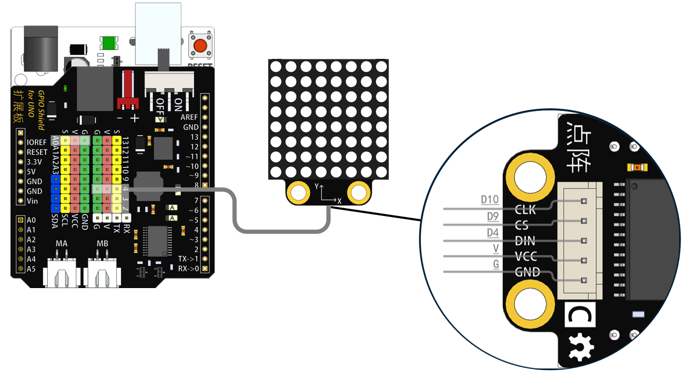

# 点阵模块

## 概述

点阵模块采用HT16K33驱动芯片驱动88点阵，通过I2C输入输出数据。HTK16K33芯片集成RC振动器，168位RAM可存储显示数据。

## 参数

* 尺寸：32x39mm
* 工作电压：5V

## 接口说明

* 可用端口：2、3、4、9、10、11、12、13、A0、A1、A2、A3

## 使用方式

## 示例代码

[点阵模块示例代码](http://www.haohaodada.com/show.php?id=956374)

## 原理图

[点阵模块原理图](https://github.com/Haohaodada-official/haohaodada-docs/blob/master/原理图/点阵模块.pdf)

## 尺寸说明

## 相关资源

[HT16K33芯片手册](https://github.com/Haohaodada-official/haohaodada-docs/blob/master/主要芯片说明书/点阵-HT16K33.PDF)

## 常见问题

