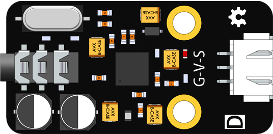
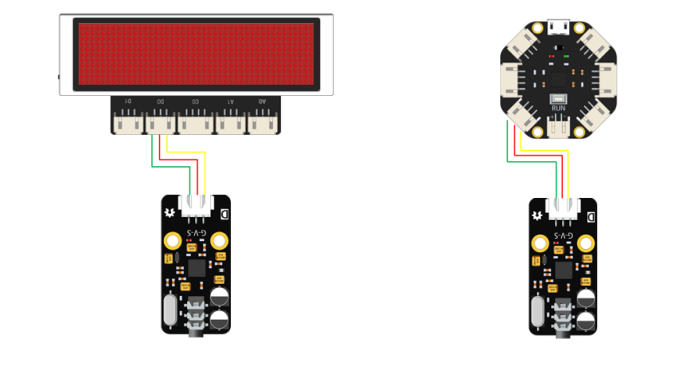
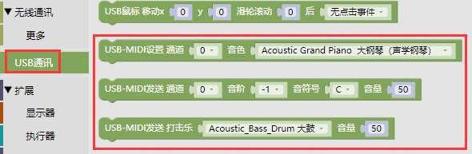
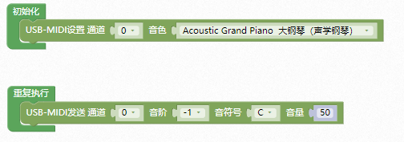
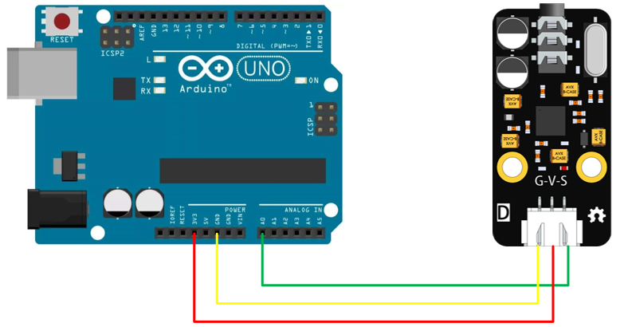
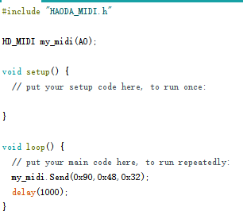
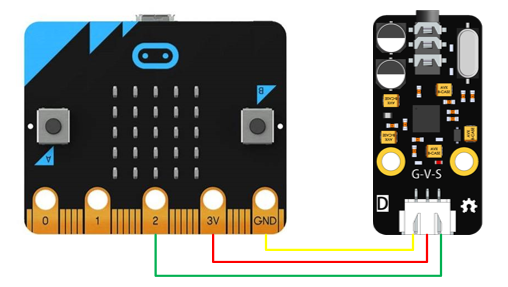
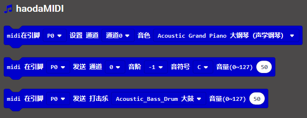
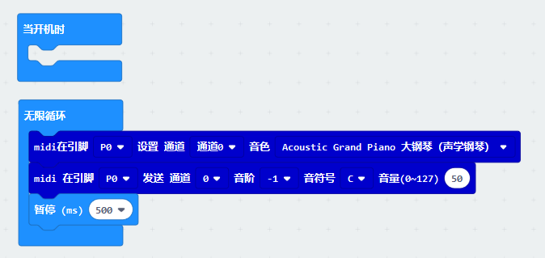
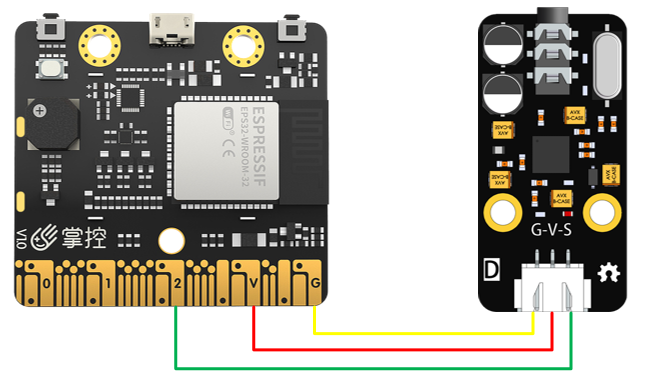

# haodaMIDI模块

## 概述

        MIDI\(Musical Instrument Digital Interface\)乐器数字接口，解决电声乐器的通信问题，MIDI传输的不是声音信号，而是音符、控制参数等指令,它指示MIDI设备要做什么，怎么做，如演奏哪个音符、多大音量等。它们被统一表示成MIDI消息\(MIDI Message\)。

        haodaMIDI采用入门级硬音源芯片，5颗高品质钽电容保证音质。可以接入各种控制器控制如microbit、掌控、好搭酷、Arduino、徽章板等。haodaMIDI硬音源带耳放，可以接耳机播放。硬音源带127种乐器音色，60余打击乐器，可以图形化编程，控制简单，完全可以制作各种电声乐器，或自动演奏乐器（相当于一支乐队）。

## 参数

波 特 率：31.25×\( 1±0.01\) Kbaud

工作电压：3.3V 接 口：XH2.54mm-3P

信        号：1-地 2-电源 3-信号 

尺        寸：48x24mm

## 控制代码

        haodaMIDI通信息协议为异步串口协议，波特率为312500，只要向通过信号线S发送MIDI控制指令，就能驱动haodaMIDI发出各种乐器的声音。 

        haodaMIDI有16个通道，其中第10通道是打击乐节奏通道，标准MIDI协议就可以通道，部分控制指令\(三字节）案例

### 切换通道音色

第一字节：C+通道4b，第二字节：通道音色（0-127），第三字节同第二字节 

示例：0xC0 0x02 0x02，表示把第一通道的音色切换为电钢琴。

### 演奏音符

第一字节：9+通道4b（除10通道），第二字节：音符（0-127），第三字节力度（音量0-127） 

示例：0x90 0x48 0x32，表示向第一通道发送4音阶的音符C，力度是50。

### 演奏打击乐

第一字节：99（第10通道），第二字节：打击乐器名，第三字节力度（单量0-127） 示例：0x99 0x35 0x64，表示大鼓发音力度为100。

## 示例

1.徽章板和好搭酷

[点击此处](http://www.haohaodada.com/hz/) 进入徽章板编程界面

[点击此处](http://www.haohaodada.com/Core/) 进入好搭酷编程界面

2.Arduino UNO

使用前，先加载库文件，库文件见附录。

3.micro:bit

haodaMIDI扩展包链接：[https://github.com/Haohaodada-official/pxt-haodaMIDI.git](https://github.com/Haohaodada-official/pxt-haodaMIDI.git)

4.掌控板

## 常见问题

Q:5V控制器怎么使用

A:可以采用降压3.3V供电，信号线串电阻限流就可以正常工作。

## 附件

Arduino库



