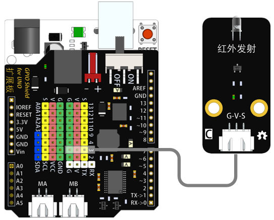
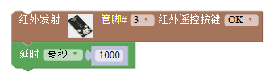
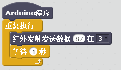

# 红外发射模块

## 概述

红外发射模块上的核心器件是红外发射管，其广泛使用在红外遥控设备上。该模块有3PIN接口，可以方便的通过Arduino等控制板实现红外遥控、通讯的功能。 红外发射管是一个能发射出特定波长红外光的二极管。红外遥控器就是使用的红外发射头发出一连串的二进制脉冲码信号。为了使其在无线传输过程中免受其他红外信号的干扰,通常都是先将其调制在特定的载波频率上,然后再经红外发射二极管发射头发射出去。

## 参数

* 尺寸：48x24mm
* 工作电压：+3.3-5V
* 接口类型：XH2.54mm-3P
* 引脚定义：1-地 2-电源 3-信号

## 接口说明

* 可用端口：2、3、4、9、10、11、12、13、A0、A1、A2、A3

## 使用方式

## 示例代码

[红外发射模块示例代码](http://www.haohaodada.com/show.php?id=956377)

## 原理图

[红外发射模块原理图](https://github.com/Haohaodada-official/docs/blob/master/jiao-xue-chan-pin/pdf/yuan-li-tu/红外发射模块.pdf)

## 尺寸说明

## 常见问题

