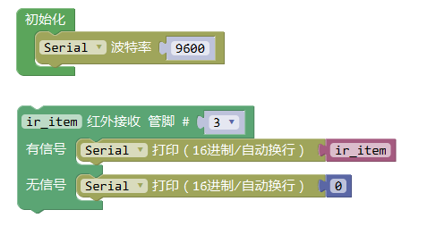

# 红外接收模块

## 概述

红外接收模块内置接收管将红外发射管发射出来的光信号转换为微弱的电信号，此信号经由IC内部放大器进行放大，然后通过自动增益控制、带通滤波、解调变、 波形整形后还原为遥控器发射出的原始编码，经由接收头的信号输出脚输入到电器上的编码识别电路。

## 参数

* 尺寸：48x24mm
* 工作电压：5V
* 接口类型：XH2.54mm-3P
* 引脚定义：1-地 2-电源 3-信号

## 接口说明

* 可用端口：2、3、4、9、10、11、12、13、A0、A1、A2、A3

## 使用方式

## 示例代码

[红外接收模块示例代码](http://www.haohaodada.com/show.php?id=956405)

## 原理图

[红外接收模块原理图](https://github.com/Haohaodada-official/docs/blob/master/jiao-xue-chan-pin/pdf/yuan-li-tu/红外接收模块.pdf)

## 尺寸说明

## 常见问题

