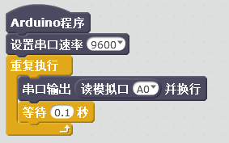

# 灰度传感器模块

## 概述

灰度模块具有微型化、智能化、多功能化的特点。它通过颜色采集，可以感知任意两种颜色然后输出相应的电压值。通过采集的顺序可以输出量可以根据需要在模拟量和数字量之间切换。采集到的颜色具有断电保持特性，如果是同样的两种颜色的分辨无需再次采集可直接使用。灵活的颜色采集方式可实现一次采集多次使用，亦可根据需要随时采集。

## 参数

* 尺寸：48x24mm
* 工作电压：+3.3-5V
* 检测距离：8-20mm
* 接口类型：XH2.54mm-4P
* 引脚定义：1-地 2-电源 3-信号

## 接口说明

* 可用端口：四排排针

## 使用方式

## 示例代码

[灰度传感器模块示例代码](http://www.haohaodada.com/show.php?id=956410)

## 原理图

[灰度传感器模块原理图](https://github.com/Haohaodada-official/docs/blob/master/jiao-xue-chan-pin/pdf/yuan-li-tu/%E7%81%B0%E5%BA%A6%E4%BC%A0%E6%84%9F%E5%99%A8%E6%A8%A1%E5%9D%97.pdf)

## 尺寸说明

## 常见问题

