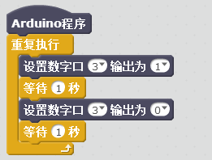

# 继电器模块说明   

## 概述
继电器模块是一种可以用较小的电流去控制外部较大电流设备的一种“自动开关”，继电器内部的常开常闭端口引出到模块的输出端口，所以模块有两个输出端，一个常开NO，一个常闭端口NC，当继电器内部线圈没导通时，继电器内部开关处于常闭。当继电器内部线圈得电，继电器内部开关处于常开，常闭断开。这样就可以实现输出控制了。 调节原理：继电器有两组接口，一组是常闭接口NC-COM,一组是常开接口NO-COM，外部设备可以选择接常开或者常闭接口，比如接一盏220V的电灯，接法可以这样：火线接到NO端口，然后从COM口把火线接到电灯，电灯另一端接到零线上。这样就可以通过编程控制继电器的闭合来控制电灯的通断。

## 参数 
- 尺寸：48x24mm
- 工作电压：5V
- 继电器型号：HF32F/005-ZS3，线圈电压5V，一组转换（常开常闭），塑封型，标准型线圈功耗，标准触点负载型，触点材料AgNi
- 最大切换电压250VAC/30VDC，最大切换电流3A（NC端），10A（NO）
- 最大切换功率750VA/90W（NC），1250VA/150W（NO）
- 额定线圈功耗450mW，接触电阻≤100mΩ
- 接口类型：XH2.54mm-3P
- 引脚定义：1-地 2-电源 3-信号

## 接口说明
- 可用端口：2、3、4、9、10、11、12、13、A0、A1、A2、A3

## 使用方式

继电器根据输入信号接通或断开电路，此模块输入信号5V，但通过继电器控制输入为12V、24V、220V等电压更大的设备（图中的220V不是唯一的）。

## 示例代码

	
[继电器模块示例代码](http://www.haohaodada.com/show.php?id=955860)

## 原理图
[继电器模块原理图](https://github.com/Haohaodada-official/haohaodada-docs/blob/master/%E5%8E%9F%E7%90%86%E5%9B%BE/%E7%BB%A7%E7%94%B5%E5%99%A8%E6%A8%A1%E5%9D%97.pdf)

## 尺寸说明

## 常见问题