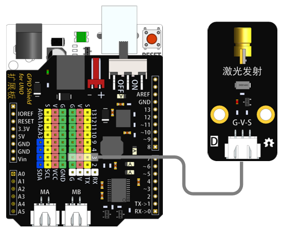
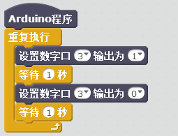

# 激光发射模块说明   

## 概述
激光发射模块可通过调节高低电平控制其激光的发射状态。

## 参数 
- 尺寸：48x24mm
- 工作电压：5V
- 接口类型：XH2.54mm-3P
- 引脚定义：1-地 2-电源 3-信号

## 接口说明
- 可用端口：2、3、4、9、10、11、12、13、A0、A1、A2、A3

## 使用方式

## 示例代码

	

	
[激光发射模块示例代码](http://www.haohaodada.com/show.php?id=955856)

## 原理图
[激光发射模块原理图](https://github.com/Haohaodada-official/haohaodada-docs/blob/master/%E5%8E%9F%E7%90%86%E5%9B%BE/%E6%BF%80%E5%85%89%E5%8F%91%E5%B0%84%E6%A8%A1%E5%9D%97.pdf)

## 尺寸说明

## 常见问题