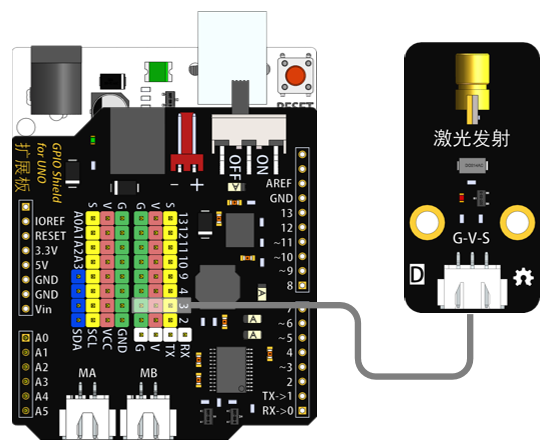
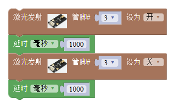
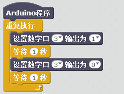

# 激光发射模块

## 概述

激光发射模块可通过调节高低电平控制其激光的发射状态。

## 参数

* 尺寸：48x24mm
* 工作电压：5V
* 接口类型：XH2.54mm-3P
* 引脚定义：1-地 2-电源 3-信号

## 接口说明

* 可用端口：2、3、4、9、10、11、12、13、A0、A1、A2、A3

## 使用方式

## 示例代码

[激光发射模块示例代码](http://www.haohaodada.com/show.php?id=955856)

## 原理图

[激光发射模块原理图](https://github.com/Haohaodada-official/docs/blob/master/jiao-xue-chan-pin/pdf/yuan-li-tu/激光发射模块.pdf)

## 尺寸说明

## 常见问题

