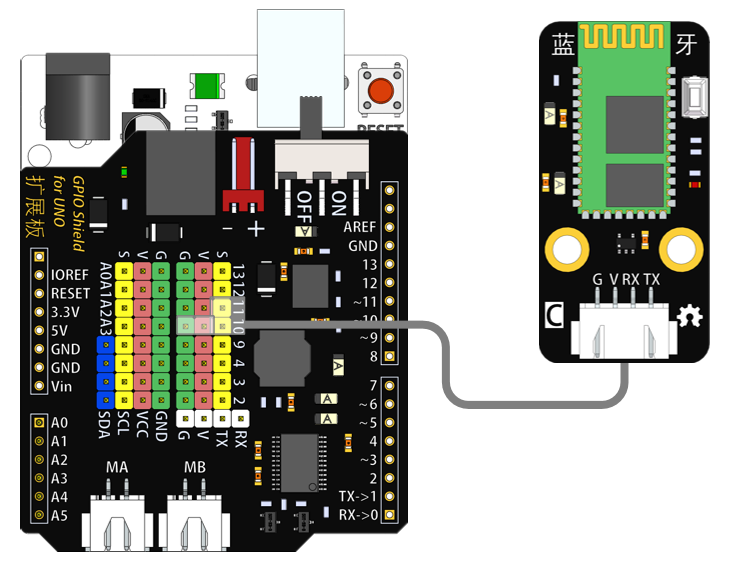
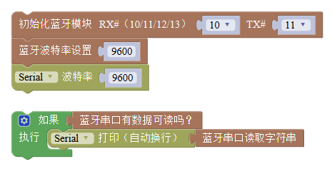

# 蓝牙模块

## 概述

如今大多高端电子设备都配备蓝牙技术，如笔记本电脑、手机、PDA等等，蓝牙技术结束了“线缆噩梦”进入了全新的无线时代。蓝牙模块带有XH接口，可与arduino主控板连接，实现蓝牙无线控制。

## 参数

* 尺寸：48x24mm
* 工作电压：+3.3-5V
* 接口类型：XH2.54mm-3P
* 引脚定义：1-地 2-电源

  **接口说明**

* 可用端口：2、3、4、9、10、11、12、13、A0、A1、A2、A3

## 使用方式

## 示例代码

## 原理图



## 尺寸说明

## 常见问题

