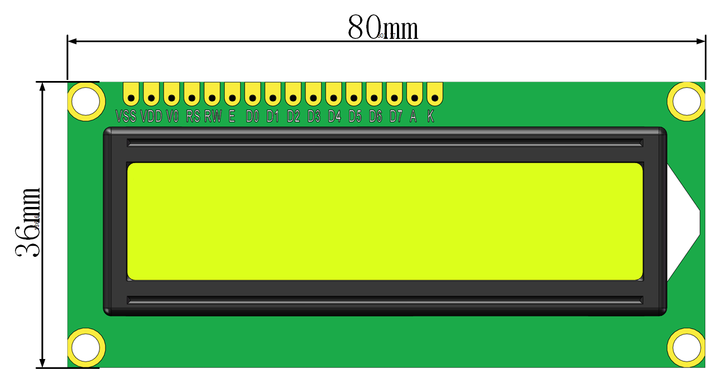

# LCD1602显示模块

## 概述

LCD模块将LCD屏镶嵌在PCB上，与arduino主控板连接后即可轻松实现其显示功能。

## 参数

* 尺寸：41.6x31mm
* 工作电压：5V
* 接口类型：XH2.54mm-4P
* 引脚定义：1-地 2-电源 3-SCL 4-SDA

## 接口说明

* 可用端口：四排排针

## 使用方式

## 示例代码

[LCD1602显示模块示例代码](http://www.haohaodada.com/show.php?id=956241)

## 原理图



## 尺寸说明

## 相关资源



## 常见问题

