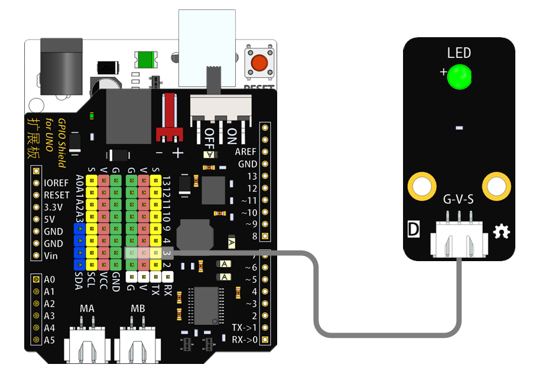
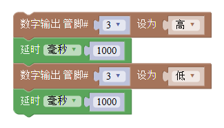
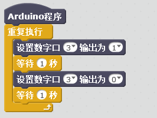

# LED灯模块

## 概述

LED灯模块根据输入信号的不同来点亮/熄灭LED，也可亮度调节。

## 参数

* 尺寸：48x24mm
* 工作电压：+3.3-5V
* 接口类型：XH2.54mm-3P
* 引脚定义：1-地 2-电源 3-信号
* LED灯颜色：白、红、黄、绿

## 接口说明

* 可用端口：2、3、4、9、10、11、12、13、A0、A1、A2、A3

## 使用方式

## 示例代码

[LED灯模块示例代码](http://www.haohaodada.com/show.php?id=955480)

## 原理图



## 尺寸说明

## 常见问题

