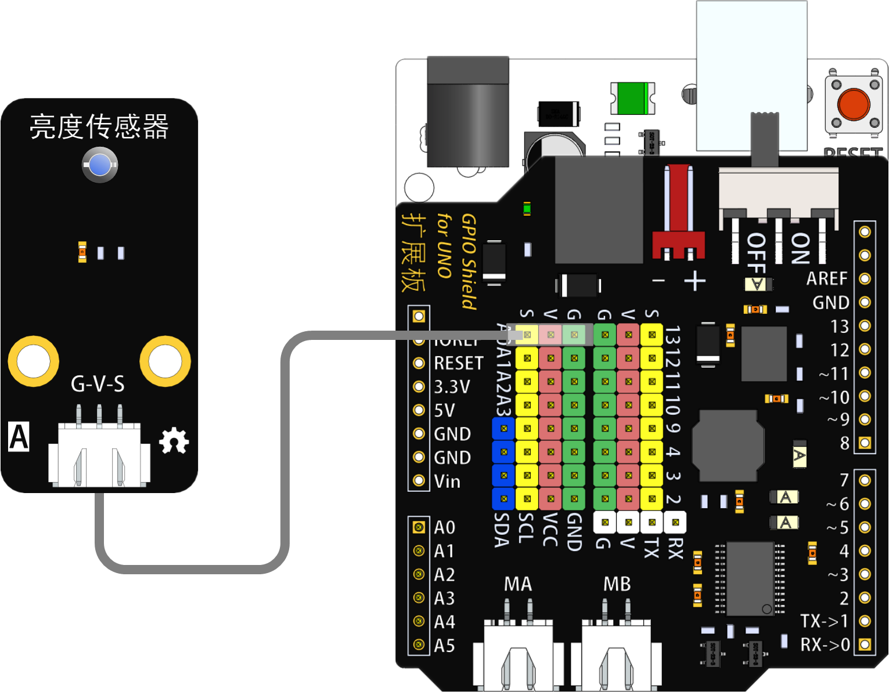
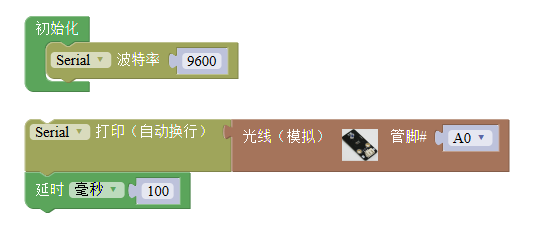

# 亮度传感器模块

## 概述

亮度传感器模块通过光敏传感器，对环境光线的强度进行检测，通常运用于随光线强度变化产生特殊效果的作品。

## 参数

* 尺寸：48x24mm
* 工作电压：+3.3-5V
* 接口类型：XH2.54mm-3P
* 引脚定义：1-地 2-电源 3-信号

## 接口说明

* 可用端口：2、3、4、9、10、11、12、13、A0、A1、A2、A3

## 使用方式

## 示例代码

[亮度传感器模块示例代码](http://www.haohaodada.com/show.php?id=956410)

## 原理图

[亮度传感器模块原理图](https://github.com/Haohaodada-official/docs/blob/master/jiao-xue-chan-pin/pdf/yuan-li-tu/光线传感器模块.pdf)

## 尺寸说明

## 相关资源

[光敏电阻数据手册](https://github.com/Haohaodada-official/docs/blob/master/jiao-xue-chan-pin/pdf/xin-pian-shuo-ming/亮度-光敏电阻.PDF)

## 常见问题

