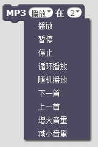
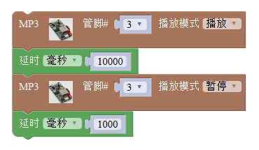

# MP3模块

## 概述

MP3模块是一款可以播放歌曲的模块，采用语音芯片YX5200进行解析音乐文件，通过喇叭发出音乐。模块上电之后SD卡下面有一个红色LED灯会亮，当其开始工作后，接线口旁边一个绿灯会闪烁。 SD卡内部mp3文件设置： SD卡内部新建文件夹，将其命名为mp3。 mp3文件夹内部放置音乐，音乐文件后缀支持.mp3及.wav后缀名。内部放置音乐文件命名必须以0001开头，最多支持65536首曲目。

## 参数

* 尺寸：48x24mm
* 工作电压：5V
* 接口类型：XH2.54mm-3P
* 引脚定义：1-地 2-电源 3-信号

## 接口说明

* 可用端口：2、3、4、9、10、11、12、13、A0、A1、A2、A3

## 使用方式

SD 卡内部 mp3 文件设置：

MP3 使用说明: SD 卡内部新建文件夹，将其命名为 mp3。 mp3 文件夹内部放置音乐，音乐文件后缀支持.mp3 及.wav 后缀名。内部放置音乐文件命名必须以 0001 开头，最多支持 65536 首曲目。

程序说明：

mp3 程序块有三个，分别为音量设置，指定曲目播放和播放模式设定。

音量设置一般放置在初始化中，设定音量 0~100，根据实际需要设置即可。

指定播放曲目需按照 SD 卡内部 MP3 音乐设置，mp3 文件夹内部设置 0001.mp3 曲目设置即可设置第一首，mp3 文件夹内部有 0255.mp3 曲目设置就可播放 255，如图所示

播放模式设定： 播放模式可以选择五种状态：播放模式选择播放即单曲循环文件夹内部第一首曲目；循环播放模式即为循环播放文件夹内部全部曲目；随机播放模式为随机播放文件夹内部曲目；暂停 是暂停当前曲目，当下一个播放命令执行时继续播放当前曲目；停止模式是停止播放。 播放方式还可选择4中方式：上一首即为播放编号排序上一首的曲目；下一首即为播放拨号排序下一首的曲目；增大音量一次即可增大一度音量；减小音量一次即可见效一度音量。

## 示例代码

[MP3模块示例代码](http://www.haohaodada.com/show.php?id=956088)

## 原理图

[MP3模块原理图](https://github.com/Haohaodada-official/docs/blob/master/jiao-xue-chan-pin/pdf/yuan-li-tu/MP3音乐模块.pdf)

## 尺寸说明

## 常见问题

