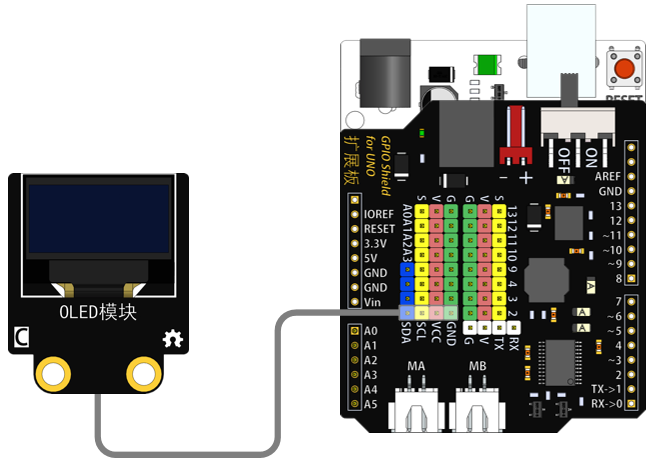
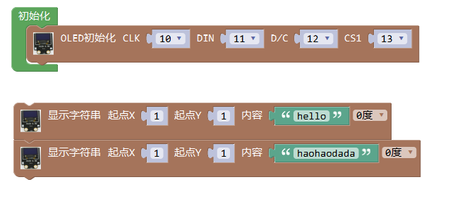
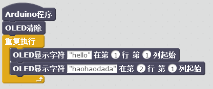
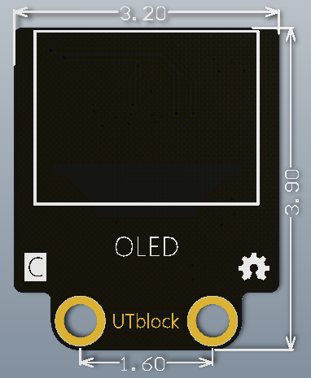

# OLED模块

## 概述

OLED模块是一款无需背景光源，自发光式的显示模块，可通过连接线与arduino主控板连接。OLED又称有机发光二极管，具备更快的响应速度和更轻薄的体积优势，功耗低，抗震性好，可广泛应用于移动设备的显示应用上。

## 参数

* 尺寸：32x39mm
* 工作电压：5V
* 接口类型：XH2.54mm-4P
* 引脚定义：1-地 2-电源 3-SCL 4-SDA

## 接口说明

* 可用端口：四排排针

## 使用方式

## 示例代码

[OLED模块示例代码](http://www.haohaodada.com/show.php?id=956375)

## 原理图

[OLED模块原理图](https://github.com/Haohaodada-official/docs/blob/master/jiao-xue-chan-pin/pdf/yuan-li-tu/OLED模块.pdf)

## 尺寸说明

## 常见问题

