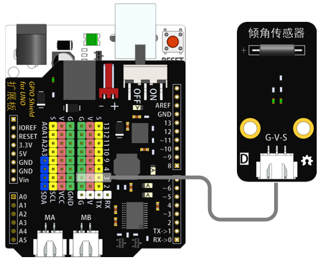
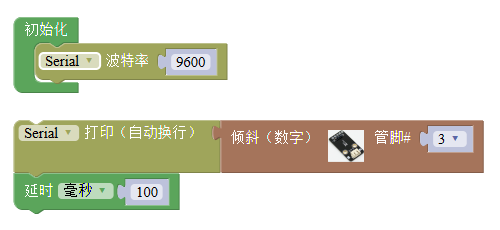

# 倾角传感器模块

## 概述

倾角开关传感器利用钢球特性，通过钢球的滚动控制其输出高低电平，与Arduino专用传感器扩展板结合使用，能够实现非常有趣的互动作品。

## 参数

* 尺寸：48x24mm
* 工作电压：+3.3-5V
* 接口类型：XH2.54mm-3P
* 引脚定义：1-地 2-电源 3-信号

## 接口说明

* 可用端口：2、3、4、9、10、11、12、13、A0、A1、A2、A3

## 使用方式

## 示例代码

[倾角传感器模块示例代码](http://www.haohaodada.com/show.php?id=956409)

## 原理图

[倾角传感器模块原理图](https://github.com/Haohaodada-official/docs/blob/master/jiao-xue-chan-pin/pdf/yuan-li-tu/%E5%80%BE%E6%96%9C%E5%BC%80%E5%85%B3%E6%A8%A1%E5%9D%97.pdf)

## 尺寸说明

## 常见问题

