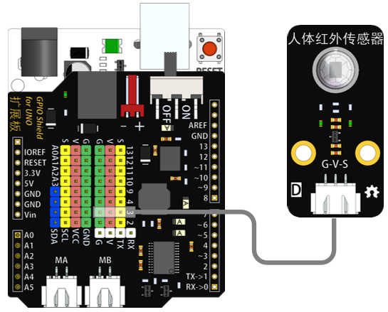
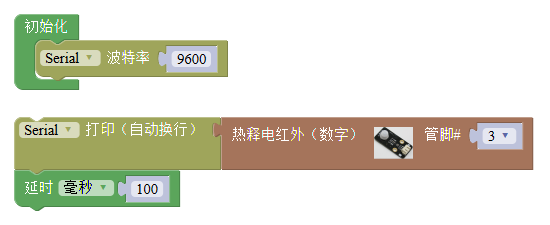

# 人体红外传感器模块

## 概述

人体红外传感器是一种能检测人或动物身体发射红外线而输出电信号的传感器，在许多领域有较好的应用前景。

## 参数

* 尺寸：48x24mm
* 工作电压：+3.3-5V
* 接口类型：XH2.54mm-3P
* 引脚定义：1-地 2-电源 3-信号

## 接口说明

* 可用端口：2、3、4、9、10、11、12、13、A0、A1、A2、A3

## 使用方式

## 示例代码

[人体红外传感器模块示例代码](http://www.haohaodada.com/show.php?id=956409)

## 原理图

[人体红外传感器模块原理图](https://github.com/Haohaodada-official/docs/blob/master/jiao-xue-chan-pin/pdf/yuan-li-tu/人体红外传感器模块.pdf)

## 尺寸说明

## 常见问题

