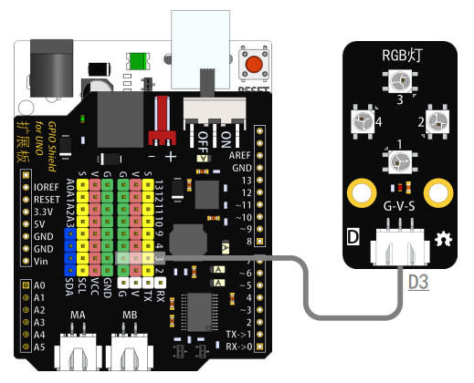
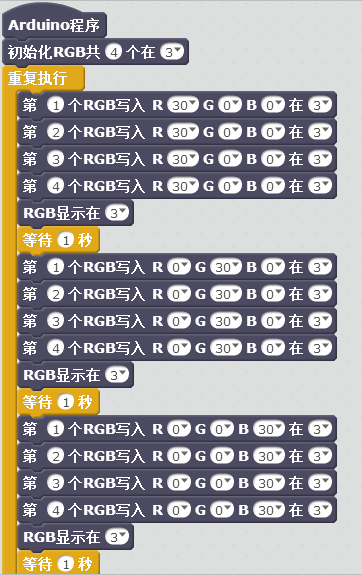

# RGB灯模块说明   

## 概述
RGB模块主要实现LED灯的各种颜色、亮度的控制，产生绚丽灯光的效果。RGB模块体积小，亮度高，拥有完美的三基色，通过组合，可以调制出各种颜色。为你的Arduino项目增添各种绚丽的动态显示。我们采用优质的RGB LED灯珠，发光角度大，并利用其内部的反射，达到最大的光藕效果。 

## 参数
- 尺寸：48x24mm
- 工作电压：+3.3-5V
- 接口类型：XH2.54mm-3P
- 引脚定义：1-地 2-电源 3-信号

## 接口说明
- 可用端口：2、3、4、9、10、11、12、13、A0、A1、A2、A3

## 使用方式

## 示例代码

	
[RGB灯模块示例代码](http://www.haohaodada.com/show.php?id=956133)

## 原理图
[RGB模块原理图](https://github.com/Haohaodada-official/haohaodada-docs/blob/master/%E5%8E%9F%E7%90%86%E5%9B%BE/RGB%E7%81%AF%E6%A8%A1%E5%9D%97.pdf)

## 尺寸说明

## 常见问题
