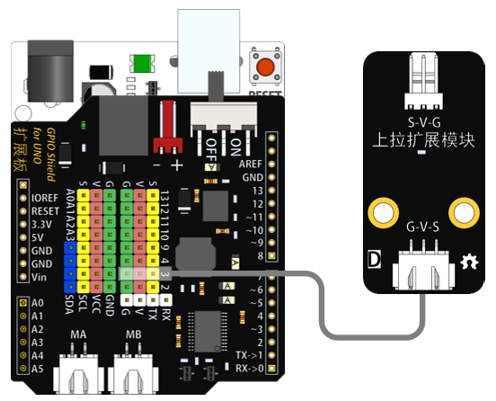

# 上拉扩展模块说明   

## 概述
上拉扩展模块用于接口转换，可通过此模块外接2510接口的模块，使模块的使用更为丰富。

## 参数 
- 尺寸：48x24mm
- 工作电压：+3.3-5V
- 接口类型：XH2.54mm-3P
- 引脚定义：1-地 2-电源 3-信号

## 接口说明
- 可用端口：2、3、4、9、10、11、12、13、A0、A1、A2、A3

## 使用方式

## 示例代码

## 原理图
[上拉扩展模块原理图](https://github.com/Haohaodada-official/haohaodada-docs/blob/master/%E5%8E%9F%E7%90%86%E5%9B%BE/%E4%B8%8A%E6%8B%89%E6%89%A9%E5%B1%95%E6%A8%A1%E5%9D%97.pdf)

## 尺寸说明

## 常见问题