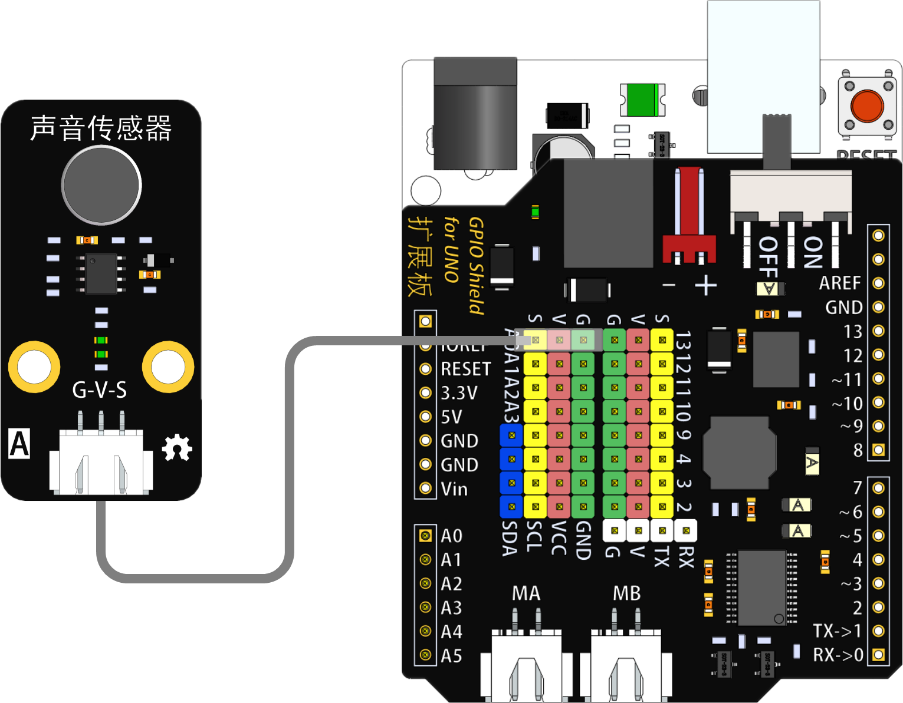
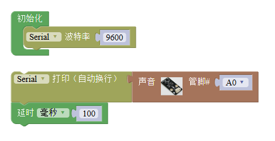

# 声音传感器模块

## 概述

声音传感器模块采用咪头采集声音信号并转化成高低电平脉冲，脉冲经过再经过LM2904运算放大器放大输出，输出大于一定阈值就能点亮绿色LED，LED随着声音强度亮灭，声音越大，LED越亮。

## 参数

* 尺寸：48x24mm
* 工作电压：5V
* 接口类型：XH2.54mm-3P
* 引脚定义：1-地 2-电源 3-信号

## 接口说明

* 可用端口：2、3、4、9、10、11、12、13、A0、A1、A2、A3

## 使用方式

## 示例代码

[声音传感器模块示例代码](http://www.haohaodada.com/show.php?id=956410)

## 原理图



## 尺寸说明

## 相关资源



## 常见问题

