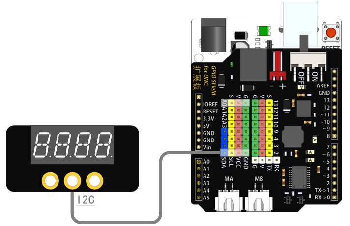
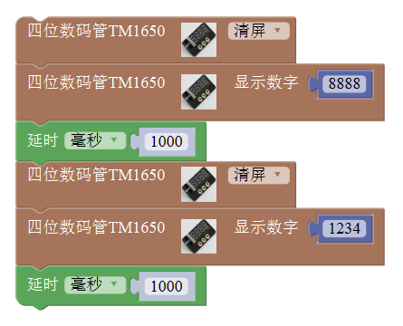
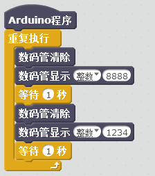
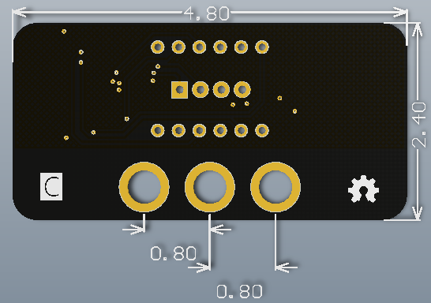

# 数码管模块

## 概述

数码管模块可显示四位数字，操作简单。

## 参数

* 尺寸：48x24mm
* 工作电压：5V
* 接口类型：XH2.54mm-4P
* 引脚定义：1-地 2-电源 3-SCL 4-SDA

## 接口说明

* 可用端口：四排排针

## 使用方式

## 示例代码

[数码管模块示例代码](http://www.haohaodada.com/show.php?id=956368)

## 原理图

[数码管模块原理图](https://github.com/Haohaodada-official/docs/blob/master/jiao-xue-chan-pin/pdf/yuan-li-tu/4位数码管模块.pdf)

## 尺寸说明

## 相关资源

[TM1650芯片手册](https://github.com/Haohaodada-official/docs/blob/master/jiao-xue-chan-pin/pdf/xin-pian-shuo-ming/数码管-TM1650.PDF)

## 常见问题

