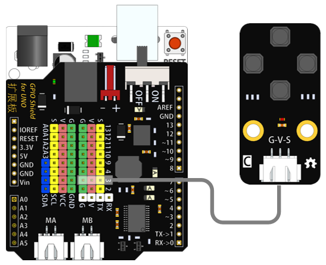
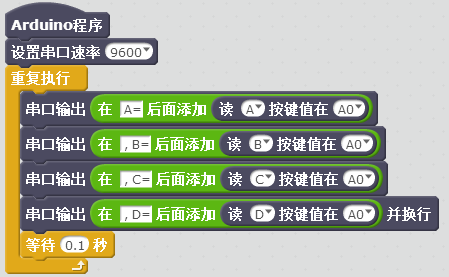

# 四按键模块说明   

## 概述
四按键模块通过AD采样实现的 ，只能接在模拟口。每个按键对应一个AD采样值（不同的输出电压值），从而实现不同按键的判别。

## 参数 
- 尺寸：48x24mm
- 工作电压：+3.3-5V
- 接口类型：XH2.54mm-3P
- 引脚定义：1-地 2-电源 3-信号

## 接口说明
- 可用端口：2、3、4、9、10、11、12、13、A0、A1、A2、A3

## 使用方式

## 示例代码

	
[四按键模块示例代码](http://www.haohaodada.com/show.php?id=955490)

## 原理图
[四按键模块原理图](https://github.com/Haohaodada-official/haohaodada-docs/blob/master/%E5%8E%9F%E7%90%86%E5%9B%BE/%E5%9B%9B%E6%8C%89%E9%94%AE%E6%A8%A1%E5%9D%97.pdf)

## 尺寸说明

## 常见问题