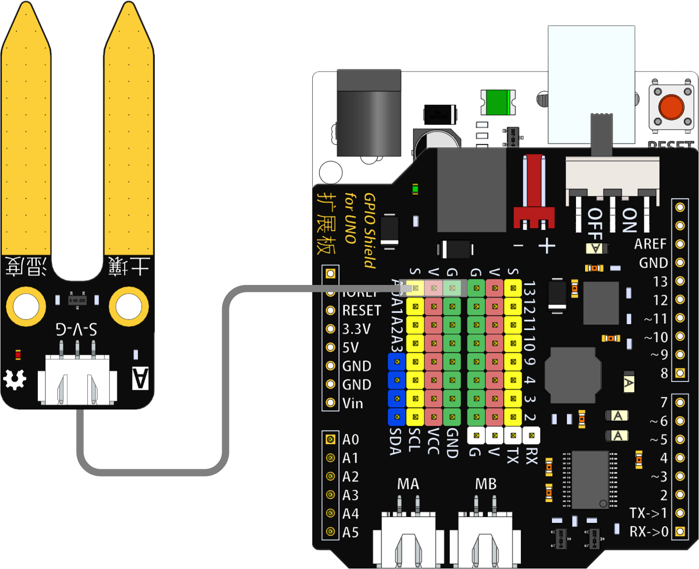
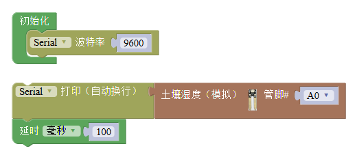
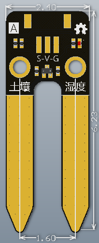

# 土壤湿度模块

## 概述

土壤湿度模块通过简易的水分传感器可用于检测土壤水分，土壤水分含量越高，传感器输出值越大。模块的传感器表面做镀金处理，延迟其使用寿命，可直接插入土壤，使用便利。

## 参数

* 尺寸：24x62mm
* 工作电压：+3.3-5V
* 接口类型：XH2.54mm-3P
* 引脚定义：1-地 2-电源 3-信号

## 接口说明

* 可用端口：2、3、4、9、10、11、12、13、A0、A1、A2、A3

## 使用方式

## 示例代码

[土壤湿度模块示例代码](http://www.haohaodada.com/show.php?id=956410)

## 原理图

[土壤湿度模块原理图](https://github.com/Haohaodada-official/docs/blob/master/jiao-xue-chan-pin/pdf/yuan-li-tu/%E5%9C%9F%E5%A3%A4%E6%B9%BF%E5%BA%A6%E4%BC%A0%E6%84%9F%E5%99%A8.pdf)

## 尺寸说明

## 常见问题

