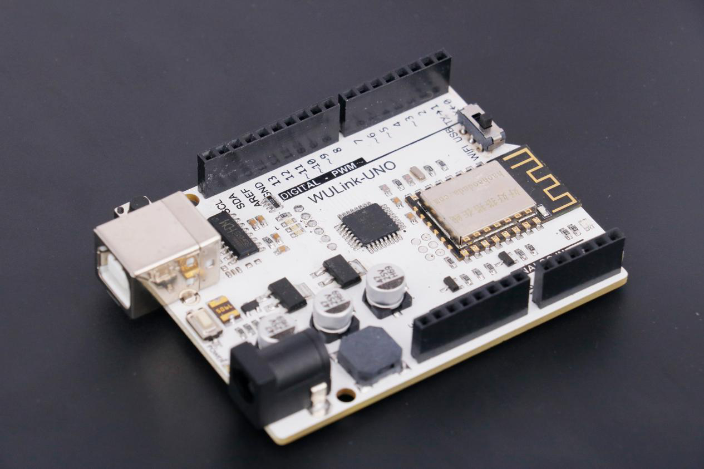

# Wulink-UNO

## 概述

wulink-UNO主板在UNO主板基础上增加了无线网卡，集云编程、无线下载、物联网通讯功能于一体，更便于下载与学习。

## 参数

* 处理器：ATMEGA328P
* CH340 USB芯片
* 电池输入电压 ：7.0 V~12.0V
* Bootloader：Arduino Uno
* 时钟频率：16 MHz
* 输入电压（推荐）：7-12V
* 输入电压（限制）：6-20V
* 支持USB接口协议及供电\(不需外接电源\)
* 支持ISP下载功能
* 数字I/O端口： 14（6个PWM输出口）
* 模拟输入端口： 6
* 直流电流 I/O端口： 40mA
* 直流电流 3.3V端口： 50mA
* Flash 内存：32 KB \(ATmega328\) \(0.5 KB用于引导程序）
* SRAM ：2 KB \(ATmega328\)
* EEPROM： 1 KB \(ATmega328\)
* 尺寸：68.5×53.3mm

## 接口说明

## 使用方式

网络配置：按住WIFI配置键开机，蜂鸣器响一声，WIFI配置指示灯红色常亮，进入好好搭搭微信公众号的好搭物联网小程序进行配置，配置成功后指示灯变蓝色。 USB下载：将拨动开关拨到USB端，连接USB端即可编程下载。 WIFI下载：配网成功后，将拨动开关拨到WIFI端即可编程下载。

## 原理图

## 常见问题

1.微信配置不上网络

请尝试用WEB方式配置。

2.配置网络的原理是什么

通过手机把我们的路由器的网络账号告诉WU-Link，让她能顺利的连上网络

3.一个路由器最多能带几台设备

一般路由建议不要超过10台设备。

4.怎么解绑MAC地址 在原来绑定的账号里删除即可，如果忘记原来帐号，请联系技术支持。

