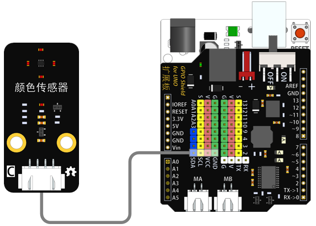
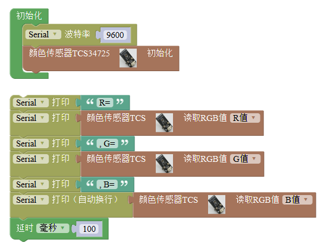

# 颜色传感器模块

## 概述

颜色传感器通过光学感应来识别物体的表面颜色。支持红、绿、蓝\(RGB\)三基色，支持明光感应，可以输出对应的具体数值，帮助您还原颜色本真。

## 参数

* 尺寸：48x24mm
* 工作电压：3.3-5V
* 接口类型：XH2.54mm-4P
* 引脚定义：1-地 2-电源 3-SCL 4-SDA

## 接口说明

* 可用端口：四排排针

## 使用方式

## 示例代码

## 原理图



## 尺寸说明

## 常见问题

