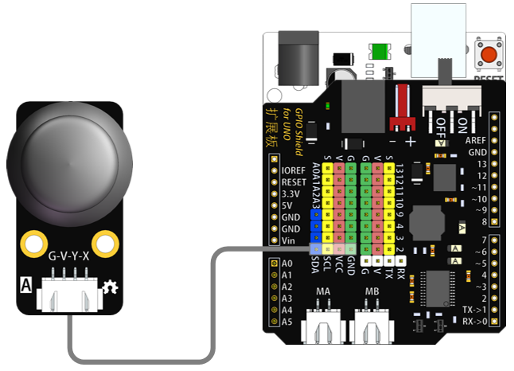
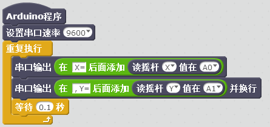

# 摇杆模块说明   

## 概述
摇杆模块可以调节输出电压，其实就是一个摇杆电位计。利用这个可以做很多应用，比如四轴飞行器的遥控手柄等。摇杆电位计内部其实是两个电位计，定义成X、Y方向。上、下方向调节一个电位器的阻值，左、右方向调节另外一个电位器的阻值。当拨杆在没有动作时处在中间位置，也就是阻值的中间值，所以用串口输出电压值时，中间是512左右，两端是0~1023。

## 参数 
- 尺寸：48x24mm
- 工作电压：5V
- 接口类型：XH2.54mm-4P
- 引脚定义：1-地 2-电源 3-SCL 4-SDA

## 接口说明
- 可用端口：四排排针

## 使用方式

## 示例代码

	
[摇杆模块示例代码](http://www.haohaodada.com/show.php?id=955811)

## 原理图
[摇杆模块原理图](https://github.com/Haohaodada-official/haohaodada-docs/blob/master/%E5%8E%9F%E7%90%86%E5%9B%BE/%E6%91%87%E6%9D%86%E6%A8%A1%E5%9D%97.pdf)

## 尺寸说明

## 相关资源

[摇杆电位器数据手册](https://github.com/Haohaodada-official/haohaodada-docs/blob/master/%E4%B8%BB%E8%A6%81%E8%8A%AF%E7%89%87%E8%AF%B4%E6%98%8E%E4%B9%A6/%E6%91%87%E6%9D%86-%E6%91%87%E6%9D%86%E7%94%B5%E4%BD%8D%E5%99%A8.PDF)

## 常见问题