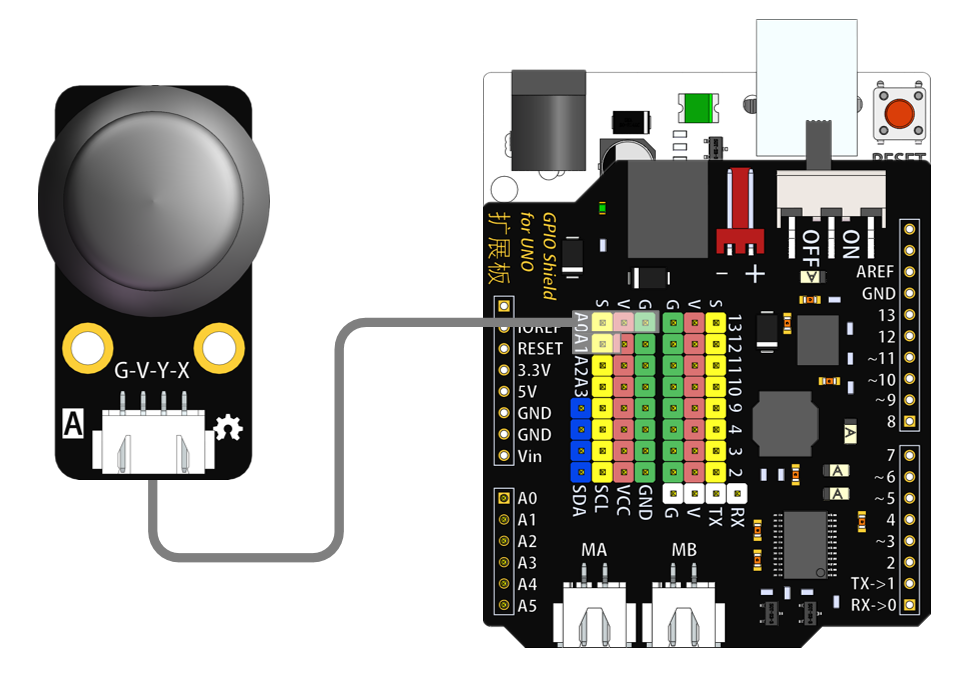
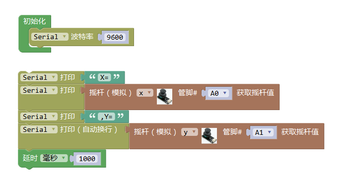

# 摇杆模块

## 概述

摇杆模块可以调节输出电压，其实就是一个摇杆电位计。利用这个可以做很多应用，比如四轴飞行器的遥控手柄等。摇杆电位计内部其实是两个电位计，定义成X、Y方向。上、下方向调节一个电位器的阻值，左、右方向调节另外一个电位器的阻值。当拨杆在没有动作时处在中间位置，也就是阻值的中间值，所以用串口输出电压值时，中间是512左右，两端是0~1023。

## 参数

* 尺寸：48x24mm
* 工作电压：5V
* 接口类型：XH2.54mm-4P
* 引脚定义：1-地 2-电源 3-SCL 4-SDA

## 接口说明

* 可用端口：四排排针

## 使用方式

## 示例代码

[摇杆模块示例代码](http://www.haohaodada.com/show.php?id=955811)

## 原理图

[摇杆模块原理图](https://github.com/Haohaodada-official/docs/blob/master/jiao-xue-chan-pin/pdf/yuan-li-tu/摇杆模块.pdf)

## 尺寸说明

## 相关资源

[摇杆电位器数据手册](https://github.com/Haohaodada-official/docs/blob/master/jiao-xue-chan-pin/pdf/xin-pian-shuo-ming/摇杆-摇杆电位器.PDF)

## 常见问题

