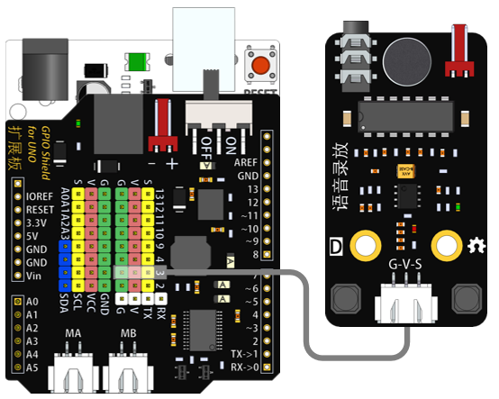

# 音频录放模块

## 概述

音频录放模块集成录放音功能为一体。可通过按键实现音频的录制和播放。

## 参数

* 尺寸：58x32mm
* 工作电压：5V
* 接口类型：XH2.54mm-3P
* 引脚定义：1-地 2-电源 3-信号

## 接口说明

* 可用端口：2、3、4、9、10、11、12、13、A0、A1、A2、A3

## 使用方式

## 示例代码

[音频录放模块示例代码](http://www.haohaodada.com/show.php?id=956129)

## 原理图

[音频录放模块原理图](https://github.com/Haohaodada-official/docs/blob/master/jiao-xue-chan-pin/pdf/yuan-li-tu/%E9%9F%B3%E9%A2%91%E5%BD%95%E6%92%AD%E6%A8%A1%E5%9D%97.pdf)

## 尺寸说明

## 相关资源

[8002芯片手册](https://github.com/Haohaodada-official/docs/blob/master/jiao-xue-chan-pin/pdf/xin-pian-shuo-ming/%E9%9F%B3%E9%A2%91%E5%BD%95%E6%94%BE-.PDF)

## 常见问题

