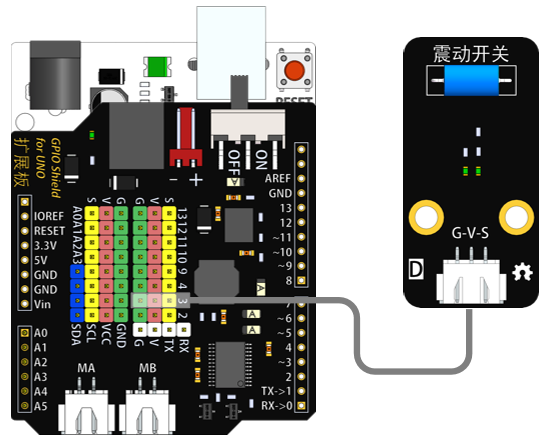
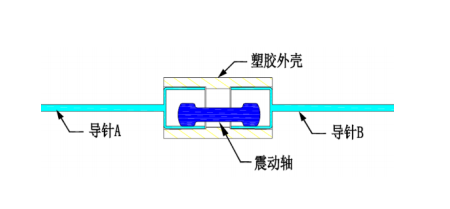
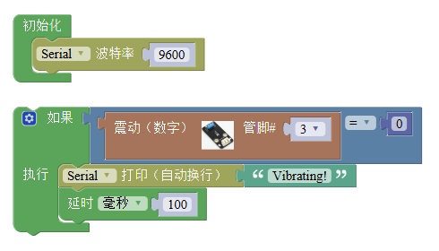

# 震动开关模块

## 概述

震动开关模块是一种常闭开关。有震动时开关内部断开，输出低电平；没震动时开关内部闭合，输出高电平。

## 参数

* 尺寸：48x24mm
* 工作电压：+3.3-5V
* 接口类型：XH2.54mm-3P
* 引脚定义：1-地 2-电源 3-信号
* 在外力震动时，达到适当的震动力时导电针将瞬间开启（ON）。
* 无方向，任何角度可能检测震动。
* 适用于小电流电路（二次回路）或触发（IC）。
* 在室温和正常使用情况下的开关使用寿命可达10万次（times/1sec）。
* 供电电压：和所用控制器一致即可。
* 开启时间：0.1ms（建议使用中断捕捉）
* 开路电阻：10Mohm
* 平时保持高电平输出，震动时输出低电平。

## 接口说明

* 可用端口：2、3、4、9、10、11、12、13、A0、A1、A2、A3

## 使用方式

震动开关内部结构：

## 示例代码

[震动开关模块示例代码](http://www.haohaodada.com/show.php?id=956409)

## 原理图

[震动开关模块原理图](https://github.com/Haohaodada-official/docs/blob/master/jiao-xue-chan-pin/pdf/yuan-li-tu/震动开关模块.pdf)

## 尺寸说明

## 常见问题

