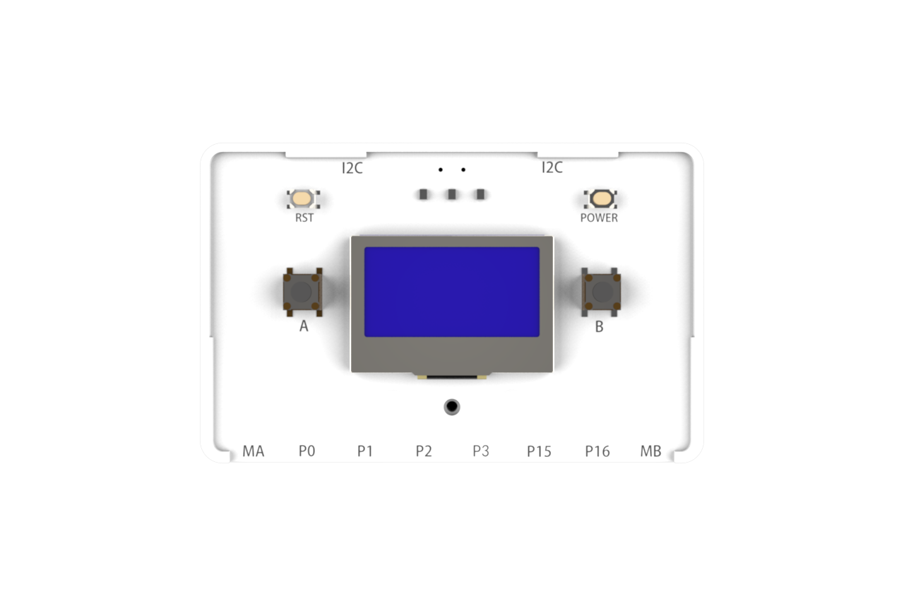
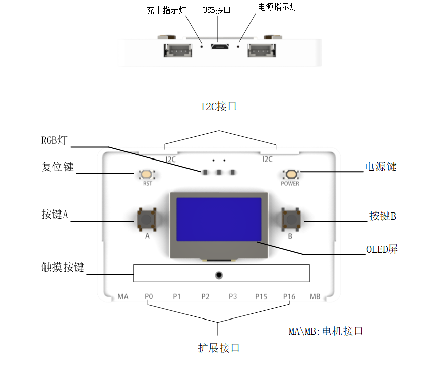
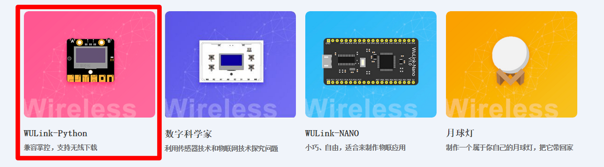
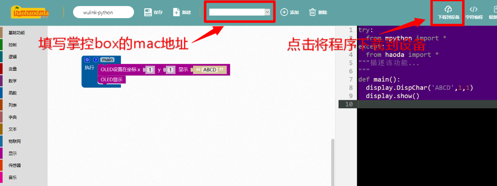
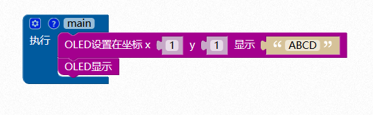

# WULink-Python

## 概述

WULink-Python是一块microPython微控制器板，可以通过编程来配合OLED屏实现各种功能的显示，板载了按键、RGB灯、温度传感器、光线传感器、声音传感器、加速度传感器、双路电机驱动、锂电池管理系统并添加外接扩展接口，兼容乐高结构，可轻松造物，实现炫酷的小发明。

## 性能参数

* 电池容量：630mAh
* 充电电压：5V
* 工作电压：3.3V
* 控制芯片：ESP-32主控芯片
* 扩展接口：2路电机接口，2路PWM接口，6路AD接口（包含PWM接口），2路通讯接口
* 尺        寸：54.3x84.8mm

## 接口说明

## 模式说明

* 运行模式：按下电源键开机，红色状态指示灯常亮。
* 充电模式: 连接USB数据线至计算机USB口或充电器，充电指示灯在充电时亮红灯，充满电亮蓝灯。

## 刷固件和联网配置

WULink-Python刷好搭固件和联网配置方式与掌控板刷好搭固件一致，点击下方查看具体操作步骤。



## 程序下载

1.使用USB线连接WULink-Python与计算机，OLED屏显示联网成功并提示空文件请下载。

2.[单击此处](http://www.haohaodada.com)进入好好搭搭网站，登录并点击进入创作界面。

3.下拉选择WULink-Python编程界面，点击进入。

4.进入编程界面后，填写WULink-Python对应mac地址，编写程序，点击下载到设备。

示例程序：

5.下载成功后，弹出对话框点击确定后，掌控板OLED屏显示ABCD。

## 相关视频

[点击此处](http://haohaodada.com/video/zk01.php)查看教程视频第一课烧写物联网固件与编写第一个程序

## 常见问题