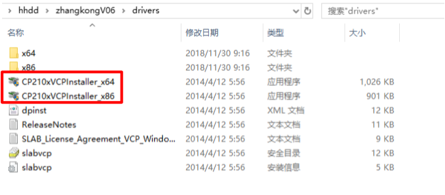

# 掌控板刷好搭固件

## 掌控板是什么

掌控板由中国创客教育专家委员会推出， 是一款教学用开源硬件，集成ESP-32高性能双核芯片，支持WiFi和蓝牙双模通信，可作为物联网节点，实现物联网应用。同时掌控板上集成了OLED显示屏、RGB灯、加速度计、麦克风、光线传感器、蜂鸣器、按键开关、触摸开关、金手指外部拓展接口，支持图形化及python代码编程。

## 好搭固件有哪些特点

1.支持无线下载。
2.具备物联网功能。
3.可与微信小程序互动。

## 好搭固件怎么刷入

1.[点击此处](http://www.haohaodada.com/art_show.php?id=201)进入好好搭搭掌控固件下载界面，点击固件下载。


打开压缩包得到如下文件：


2.进入drivers文件夹根据计算机情况选择安装驱动程序。




点击完成则驱动安装完毕。

3.驱动安装完成后打开setwifi应用，（如下图）选择串口。，弹出黑色窗口并显示烧写进度，烧写完毕后黑色窗口自动关闭。


掌控板上电后，按住A键的同时按下烧写固件按键。


弹出黑色窗口并显示烧写进度，烧写完毕后黑色窗口自动关闭。


4.黑色串口自动关闭后，按下掌控板RST键。


掌控OLED显示屏显示如下界面，固件烧写完毕。（如未显示二维码界面，按住掌控B键同时按下RST键重启掌控板）


## 联网配置

1.扫描上图二维码进入微信公众号-掌控操作说明。


2.根据说明按住掌控板B键，进入配网状态，显示配网界面。扫描二维码获取mac地址。


3.打开setwifi应用程序，输入欲连接的wifi名称及密码点击设置进行配网。连接成功后显示已连接并跳转到如下界面及配网成功。


## 编程

1.[点击此处](http://www.haohaodada.com/wulink-python/)或通过好好搭搭网站的创作界面进入掌控编程界面并登录。


2.示例代码


3.成果


```text
注意：每一次烧写程序先要捏P键按下RST重启清空程序。
```

## 视频

[点击此处](http://haohaodada.com/video/zk01.php)查看教程视频第一课烧写物联网固件与编写第一个程序

[点击此处](http://www.haohaodada.com/video/zk02.php)查看教程视频第二课好搭物联网小程序与掌控在线编程

## 第三方资料

[点击此处](https://mpython.readthedocs.io/zh/latest/board/hardware.html?tdsourcetag=s_pctim_aiomsg)查看掌控硬件概述
