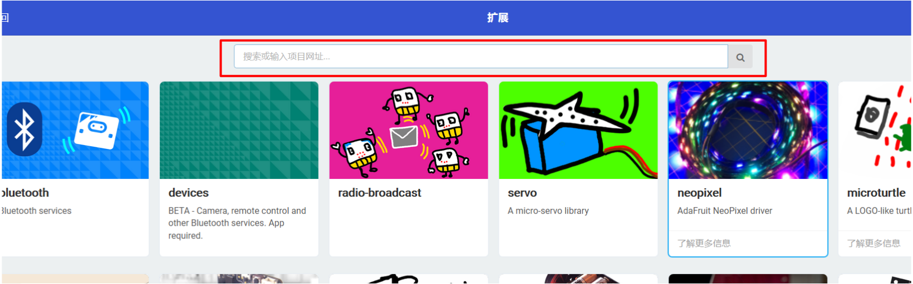
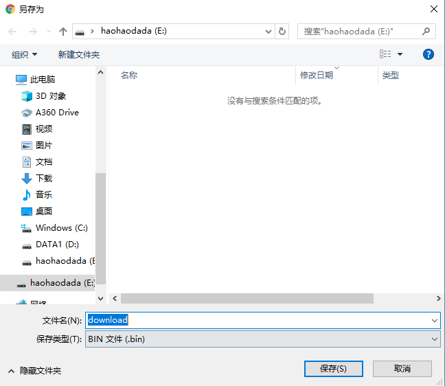

# 好搭Bit

## 概述

兼容micro bit，好搭bit带有5x5点阵屏，可以通过编程来使其显示各种字符，数字，表情及图案。板载了按键、指南针、加速度传感器、双路电机驱动、锂电池管理系统并添加外接扩展接口，支持U盘下载模式，兼容乐高结构，可轻松造物，实现炫酷的小发明。

## 性能参数

* 控制芯片：32位ARM芯片
* 电池容量：630mA
* 充电电压：5V
* 下载方式：U盘下载模式
* 扩展接口：2路电机接口，3路AD接口，6路PWM接口（包含3路AD接口），2路通讯接口
* 尺        寸：54.3x84.8mm

## 接口说明

## 模式说明

* 运行模式：按下电源键开机，红色状态指示灯常亮。
* 下载模式：连接USB数据线至计算机，按下电源键开机，红色状态指示灯常亮，下载程序时红色状态指示灯闪烁。
* 充电模式: 连接USB数据线至计算机USB口或充电器，充电指示灯在充电时亮红灯，充满电亮蓝灯。

## 使用方式

### 浏览器下载路径询问设置

好搭bit采用U盘下载模式下载程序，点击下方查看浏览器下载路径设置方法。



### 程序下载

1.使用USB线连接好搭bit与计算机，按下好搭bit电源键，计算机检测到U盘接入。

2.[单击此处](http://www.haohaodada.com)进入好好搭搭网站，登录并点击进入创作界面。

3.下拉选择好搭bit编程界面，点击进入。

4.进入编程界面后，点击新建项目，进入图形化编程界面，按如下图所示顺序点击操作。

5.点击扩展后进入如下界面。

6.在搜索栏输入如下网址，点击搜索得到扩展包。

https://github.com/Haohaodada-official/pxt-HaodaBit.git

7.点击HaodaBit扩展包可添加好搭bit图形化编程栏，即可开始编程。

示例代码：

8.编程完成后，点击下载键。

选择下载路径为haohaodada U盘，点击保存，好搭bit的LED灯闪烁后，LED灯常亮表示程序下载完成。

9.下载完成即LED灯常亮，好搭bit点阵屏显示笑脸。

## 常见问题