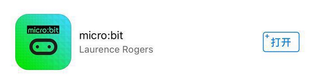
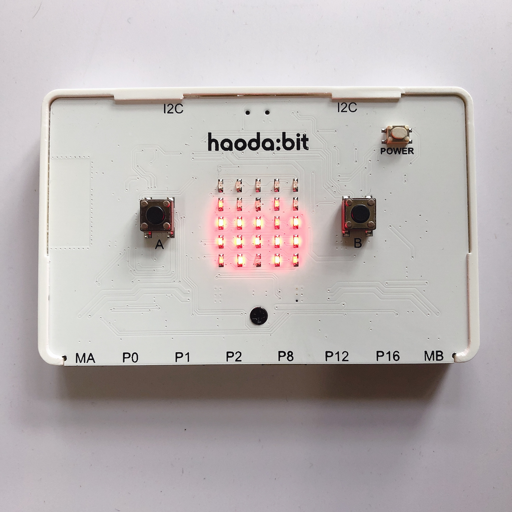
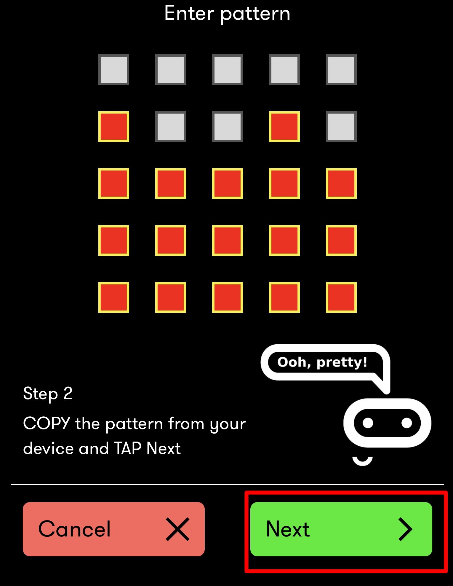
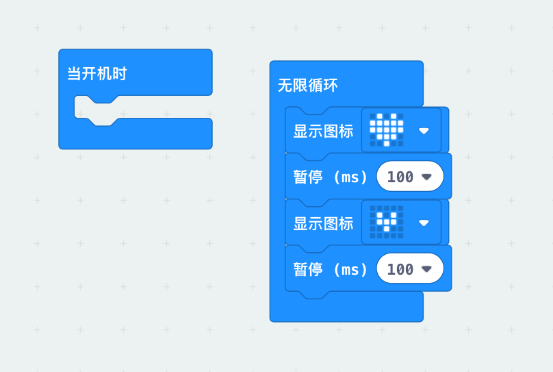

# APP 移动端编程

1.打开 micro:bit app。点击“choose micro:bit”连接设备。

2.进入如下界面。

按下好搭Bit的POWER键开机，按住A键和B键的同时，按下POWER键关机，再次按下POWER键开机（此过程AB键不可松开）。重新开机后A、B键按住持续3秒左右。此时好搭Bit点阵屏显示动态图案后，后固定为一个图案，按下上图所示界面“NEXT”键，将点阵屏图案填入app中，点击“NEXT”。

示例：

好搭Bit显示图案

app端填入图案

输入图案后，进入如下界面，直接点击“NEXT”。

3.设备开始连接，连接成功后显示如下界面，按“ok”即可。

4.进入主界面，进入“create code”，开始编程。

5.编写程序，点击右下角小图标，将程序下载到设备。

示例程序：

6.开始下载。

7.下载完成，好搭Bit点阵屏显示跳动的爱心。

