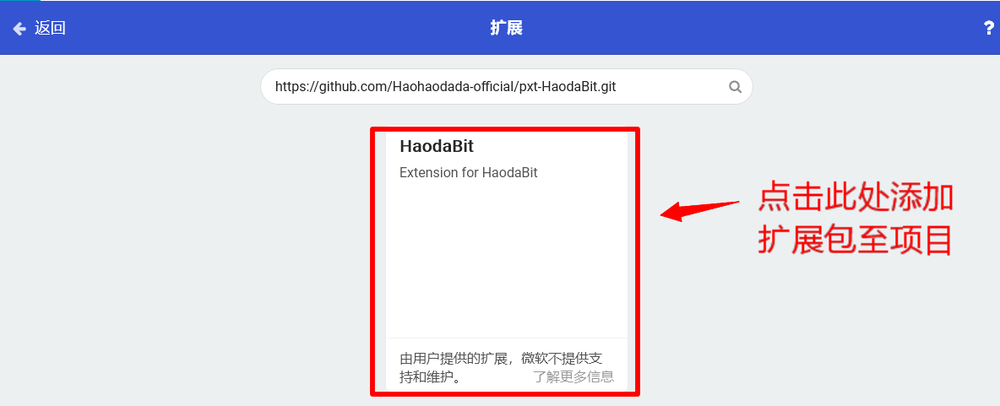
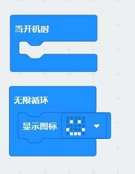
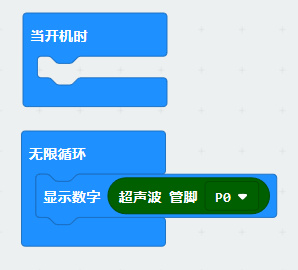

# MakeCode

1.好搭Bit通过USB线连接到电脑，按下power键开机，电脑检测到名为MICROBIT的U盘。

2.打开MakeCode离线版程序，点击新建项目。

3.按如下顺序添加扩展包。

4.在空白栏输入扩展包地址（[https://github.com/Haohaodada-official/pxt-HaodaBit.git](https://github.com/Haohaodada-official/pxt-HaodaBit.git)），点击搜素，点击搜索到的HaodaBit扩展包添加至项目。

5.编写程序，点击下载键将程序下载到设备。

示例程序1：

点击下载后，好搭bit状态指示灯闪烁，待指示灯熄灭后程序下载完成，好搭Bit点阵屏显示笑脸。

示例程序2：

将超声波模块与好搭bit的P0口连接，点击下载后，好搭bit状态指示灯闪烁，待指示灯熄灭后程序下载完成，点阵屏滚动显示超声波所测值。

