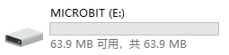
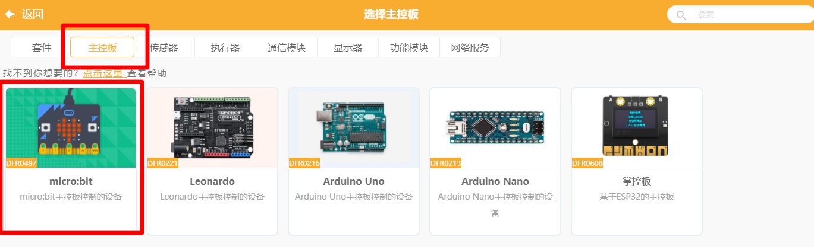
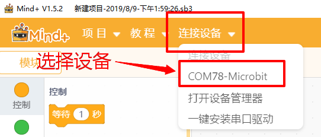
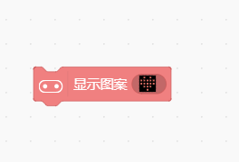
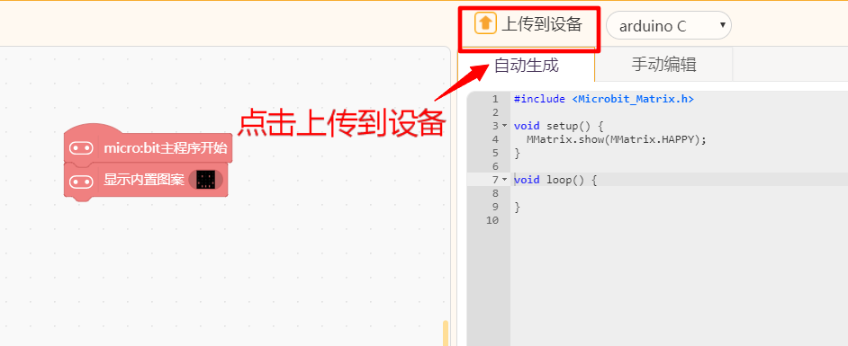

# Mind+

1.将好搭Bit通过USB线连接电脑，按下电源键开机，电源灯亮起，电脑检测到U盘MICROBIT。

2.打开mind+，右上角选择模式处，选择模式（两种模式均可用来控制好搭Bit），点击扩展选择设备。

3.选择主控板microbit。

图形化栏出现microbit图形块。

4.点击连接设备，选择设备。

5.程序下载。 

实时模式： 

编写程序，单击代码图形块，好搭bit执行相应程序。

单击此图形快，好搭Bit点阵屏亮爱心图案。

上传模式： 

编写程序，点击下载到设备。

上传成功，好搭Bit点阵屏显示笑脸图案。

